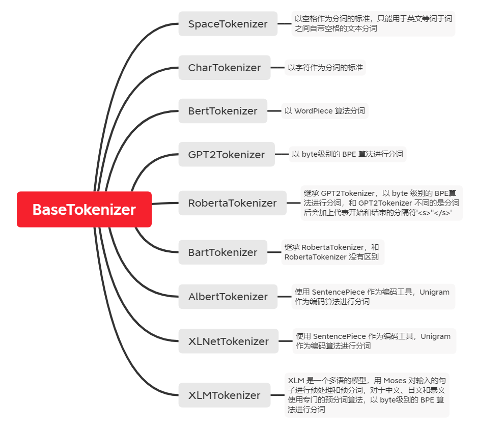

[TOC]

## 预训练模型文档

​		前期主要对预训练模型的相关知识进行了一个整体的学习，然后把学习的笔记以文档的形式整理了一下，希望能够对接下来需要入门的同事有所帮助。

## tokenization

​		因为要写悟道工具包的 tokenizer 部分，所以对现有的分词算法，包括 word-base, character-base, subword, BPE, BBPE, WordPiece, Unigram, SentencePiece，进行了调研，并且把相关的笔记整理成了文档的形式。

## SAT

​		跑了一下 SwissArmyTransformer，整理了安装、配置、运行的流程以及可能遇到的问题。

## cpt-bm

​		悟道工具包的 tokenization 和 vocab 模块，主要部分已经 push 到 gitee，增加了 XLM 模型的 tokenizer，对每个 tokenizer 写了说明文档。

