# 大规模预训练模型

[TOC]

## 背景


### 2018，NLP的预训练元年

​		首先介绍一下背景，在自然语言处理领域发展的过程中，有很多重要的时间节点，比如2013年的 word embedding 问世，比如2015年的 attention 机制开始崭露头角。而在2018年，以 ELMo、GPT、BERT 为代表的预训练模型带来了一场NLP领域的变革，使得2018年成为了代表预训练语言模型的时间节点。

​		在2018年之前，自然语言处理领域的工作都偏向于在具体数据集上做一些精细的特征工程，或者基于RNN或者CNN等基础的神经网络进行更为精巧的模型设计，使得模型能够在一些特定的下游任务上取得更好的效果。然而在2018年，随着这些预训练模型逐渐问世，我们会发现它们有一种“一力降十会”的神奇效果，模型本身非常“暴力”（参数量多，数据量大，计算量大），但是效果却非常地好。从BERT屠榜11个各种类型的自然语言处理任务开始，整个领域的工作重心，就开始向基于预训练模型来做下游任务移动，自然语言处理领域开始了一次彻底的重新洗牌。

​		BERT等预训练模型在GLUE的9个任务和对话系统等生成任务上的出色表现，可以说预训练语言模型已经拥有了一定的**自然语言理解**和**自然语言生成**的能力。

​		自2018年之后，预训练语言模型开始朝参数量更多，数据量更大，计算量更大的方向发展，虽然说**现在我们也不确定，这种把模型越训越大的方式是不是一条正确的道路，但是在我们目前的视野范围内，这种方式确实能带来进一步的性能提升**。

​		自此以后，各大公司就像开展军备竞赛一样，随着算力的增强，增加预训练模型的参数和数据量，预训练模型的规模在近两年来以每年约10倍的速度增长。

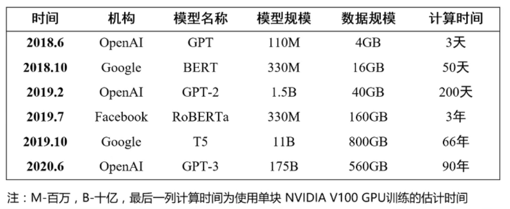

​		在2020年6月，GPT-3问世的时候，引发了极大的轰动。

****

- GPT-3 为什么能“出圈”
  - 参数量大，训练消耗大量计算资源
  - 本身具备了一定的知识，并能进行一定程度上的推理
  - 具备了强大的**零次/少次学习能力（Zero/Few-shot Learning）**

  ​		深度学习模型需要大量的有监督数据进行学习，但是GPT-3展示出了通过少量样本，完成对下游任务的学习的能力，比如先喂给GPT-3几个英译汉的平行句对，再给一个英文句子，GPT-3就能给出对应的中文翻译，这种能力一定程度上颠覆了我们对于深度学习的认知。**一定程度上可以这么认为，在预训练的过程中，通过学习大量的无监督语料，预训练模型已经具备了很强的“语言能力”，我们在做下游任务的时候，只需要想办法激发它的能力**。

****


### 迁移学习

​		虽然很多人视2018年为预训练模型的“元年”，但是其实预训练模型中的许多理念和技术，并不是首创，在过去的几年甚至几十年中，它们早就已经在学术界出现。

​		我们首先来看看传统深度学习的模式， 传统的深度学习一般会根据特定任务，构建一个模型架构，通过有标注数据训练模型，再利用损失函数来优化模型参数，得到最终的模型，最后通过测试数据来测试模型的泛化能力。	

​		但是传统深度学习模式会面临的如下的几个挑战：

​		1、缺少大规模的有监督数据（数据标注成本高）

​		2、模型深度有限（在数据量小的情况下，模型深度就无法加到很深，否则参数量大，数据量小，容易导致过拟合）

​		3、针对不同的下游任务去做专门的模型结构，泛化能力差

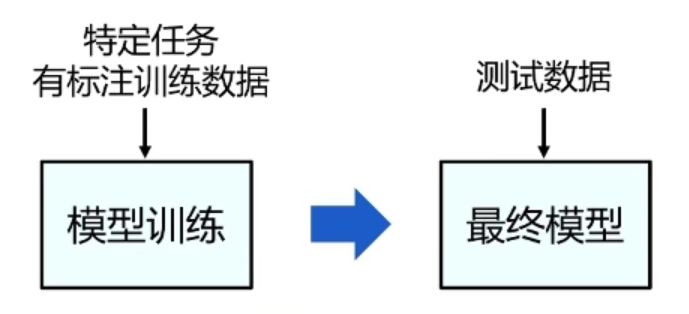

​		而预训练语言模型则是**基于大规模无标注文本**，自动学习通用语言模式，得到一个预训练语言模型，然后再通过少量的特定任务的有标注训练数据，来对模型进行参数微调，最后得到的这个模型再用于下游任务。

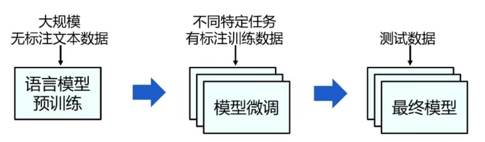

​		我们可以看到这两张图的主要差别，就在于预训练这种方式，多了一步大规模无标注数据的训练，在有标注数据不够多的情况下，我们尽可能通过无标注的数据先学习一些对下游任务有用的通用的知识，然后再把它们用到下游任务上。这种预训练的逻辑，相比于传统的深度学习，**泛化能力更强，可用于多种下游任务**。

​		预训练和微调的基本范式可以溯源到**迁移学习**（某种程度上来讲，预训练就可以认为是一种迁移学习），就像人类可以应用以前学到的知识来更快地解决新问题，模型也可以通过抽取无监督数据中的知识，用于解决下游任务（通过**预训练-微调**框架来实现**知识获取-知识迁移**）。

***

- 迁移学习

  ​		在迁移学习中会定义一些原任务和目标任务，在直接做目标任务有困难的情况下，在原任务上做一些训练，提取一些对目标任务有用的知识，再把这些知识迁移到目标任务上，使得目标任务有一定的效果提升。

****

​		知识迁移的方式有很多种，其中比较典型的有 **feature-representation-transfer**（特征表示迁移）和 **parameter-transfer**（参数迁移），在之前广泛应用于自然语言处理任务的 word embedding 就是一种 feature-representation-transfer，现在大火的 BERT，则是一种 parameter-transfer。

​		在自然语言处理之前，计算机视觉领域已经尝试了基于知识迁移的预训练框架（**ResNet**）并取得了出色的效果。

***

- ResNet
  - 在大规模有监督数据 ImageNet 上进行预训练
  - 在下游任务上微调
  - 采用**深层**的卷积神经网络

***


### 自监督学习

​		在计算机视觉领域有 ImageNet 这种大规模的标注数据，但是更多的是无标注的数据（我们可以从互联网上几乎无限地获得这些数据），而在自然语言处理领域，几乎不存在类似于 ImageNet 这种大规模的通用标注数据。所以我们不禁会想，**能不能使用一些无标注的数据来获取知识呢？**

​		这时候就会提到另外一个研究 —— **挖掘数据内部信息作为监督信号的自监督学习**，自监督学习构造正例和负例的方式不是通过人工的标注，而是通过某些操作来自动地构造监督信号，一个比较典型的就是对比学习。

***

对比学习

- 正例：同一张图片的不同处理结果，随机裁剪，颜色失真，随机高斯模糊等
- 反例：其他图片

***

​		自监督学习和无监督学习的共同点在于，他们都会使用无监督数据，而不同点在于无监督学习一般用于做诸如聚类之类的不带标签信息的任务，而**自监督学习的数据本身是不带标签的，但是任务则是带有标签的**。在预训练模型之前，自监督训练本身就一直在发展，而预训练模型就是自监督的一种学习方式。


## 计算机视觉领域的预训练

​		在背景部分中，提到了一些计算机视觉领域的例子，自从深度学习火起来以后，预训练就是计算机视觉领域的一种常规做法，有比较长的发展时间了，而且在发展的初期，视觉领域的预训练方法效果明显会更好，所以我们先从计算机视觉领域的预训练说起。

​		在对图像（视频可以看做是逐帧的图像）做预训练时，一般的网络结构是多层的CNN叠加，可以先用预训练的数据集A对这个网络进行训练，在A任务上学习网络参数，将模型保存下来。当面临另外一个任务B时，**使用和任务A相同的模型结构，在模型比较浅的几层CNN中直接加载任务A学习好的参数，其他高层的CNN参数仍然采用随机初始化**。然后用B任务的训练数据来训练网络，此时有两种做法，一种是浅层加载的参数在训练B任务的过程中不进行参与反向传播，这种方法叫“Frozen”，另一种方法则相反，浅层加载的参数也会随着训练进行调整，这种叫“Fine-Tune”，就是对参数进行微调使其能够更好地适应当前任务。

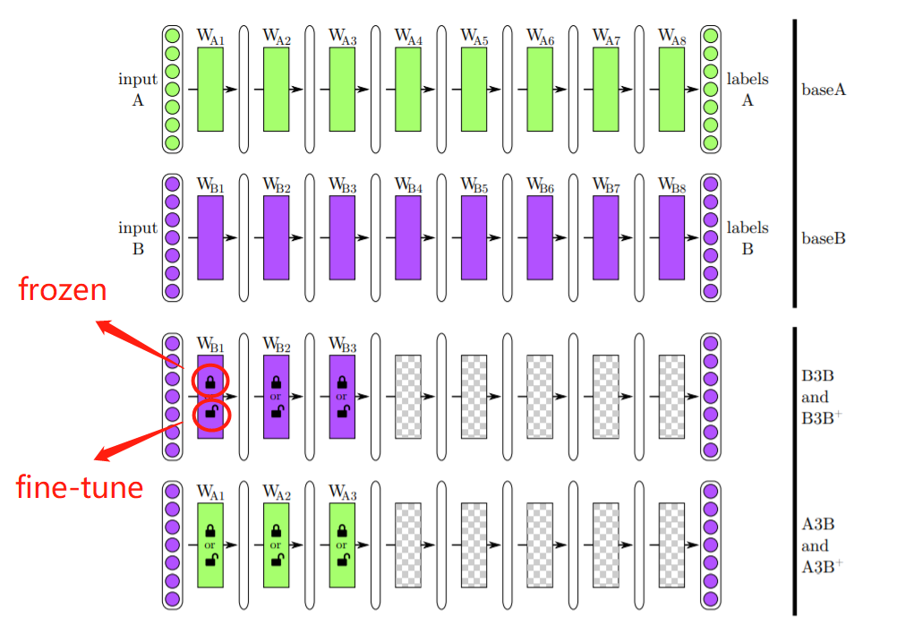

​		这么做有几个好处，首先，如果当前任务B训练数据量较少的话，衔接段效果好的以CNN为基础的模型网络结构层数都比较深，参数量非常大，训练数据太少很难训练如此复杂的网络，容易过拟合，但是如果其中大量的参数通过大的训练集比如 ImageNet 预先训练好，直接拿来初始化大部分参数。然后再在新的小数据集上进行微调，让参数更适合做新任务，那么效果就会好很多。这样就能够做到**“在小数据集上训练大模型”**的效果。即便当前任务的训练数据不少，运用预训练也能大大**加快模型的收敛速度**，所以预训练在视觉领域成为了一个非常普适的解决方案，再加上效果又好，所以在视觉领域十分盛行。

​		对于多层的CNN来说，不同层级的神经元学到的是不同类型的图像特征，自底向上形成层级结构，如下图所示，在人脸识别任务中，我们把训练好的网络每层学习到的特征做一个可视化，那么我们能看到，最底层的神经元学到的是线段，中间学到的是五官的轮廓，最后一层学到的是人脸的轮廓，通过深度的神经网络，实现特征的层级结构的抽取，**越是底层的网络抽取到的特征，可泛化性就越强**（无论什么样的图像，都会需要用到像线段这样的基础特征），越高层的神经网络抽取出的特征，就越是和具体任务高度相关的。正因为如此，所以预训练好的参数，特别是用于抽取基础特征的底层网络参数，和具体任务越无关，就越具备任务的通用性。这就是一般用底层预训练好的的参数初始化新任务网络参数的原因，而高层特征和原任务关联性较大，实际可以不使用。

​		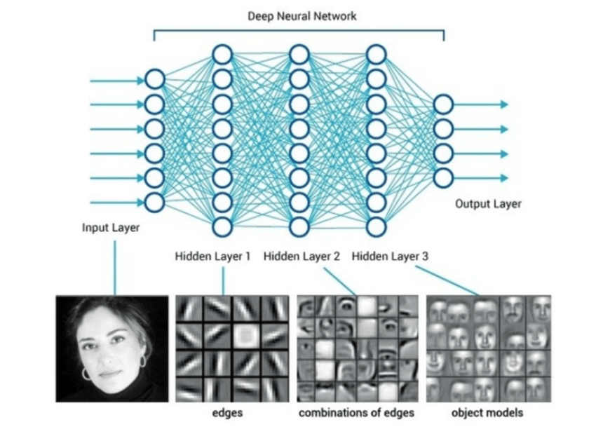

​		在计算机视觉领域，用来做预训练一般是 ImageNet，为什么用它呢？第一，ImageNet 本身拥有超多标注数据，体量很大；第二，因为 ImageNet 有1000个类别，算是通用的图像数据，跟领域没有太大关系，所以通用性好。

​		在介绍完视觉领域的预训练后，如果是在2018年这个预训练在自然语言处理领域爆发的时间节点之前，我们自然会产生两个问题：

​		1、计算机视觉领域有 ImageNet 这个通用的数据，并且图像网络天然存在通用的底层特征，那么在自然语言处理领域，不同类型的下游任务之间通常存在比较大的 gap，要预训练一个怎样的任务，它的参数才能拿来通用呢？

​		2、既然预训练能在计算机视觉领域好用，那么为什么在自然语言处理领域没有发展呢？

​		要回答这两个问题，就要说到词向量（word embedding）和语言模型（language model）。


##  语言模型和词向量

### 语言模型		

​		在计算机视觉领域的预训练中，我们提到了 ImageNet，作为一个“通用”的图像数据集，非常适合拿来做预训练这样一个任务，那么回到自然语言处理领域，我们是不是应该想一想，一个什么样的任务，才能起到和 ImageNet 同样的效果。

​		那么，什么样的NLP任务，我们只要预训练它，它提取的特征就能很好地迁移到其他任务上去呢？在上一部分提到了，在NLP中不同类型的下游任务之间存在较大的 gap，如果我们预训练一个机器翻译模型，要拿这个模型去做文本分类，或者我们预训练一个命名实体识别的模型，要拿来做对话生成，似乎都不太可行。

​		这时候大家可能就想到了语言模型（language model），先来介绍一下语言模型，简单来说，语言模型就是**一串词序列的概率分布**，如下图所示，其作用是为一个长度为m的文本确定一个概率P，表示这段文本是“人话”的概率。

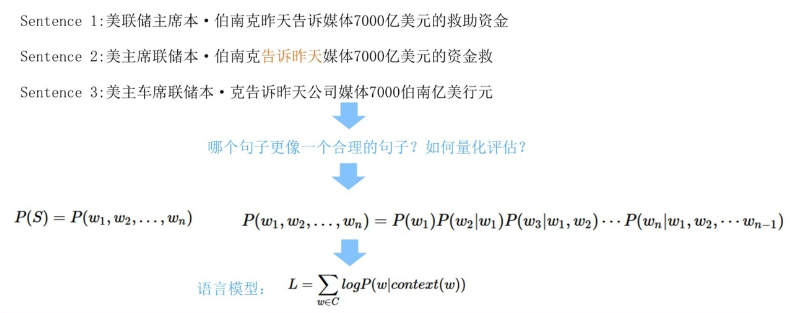

​		语言模型的训练过程，就是为了量化哪个句子更像一句“人话”，根据上文（w_1，w_2，...，w_n-1）去预测下一个词（w_n）是什么（其实除了上文之外，也可以引入下文联合预测单词出现的概率），一个句子中所有单词根据上文预测自己的概率相乘，就是这个句子“像一句人话”的概率。这**不需要人工标注语料，它本身训练所需的监督信号，就来自训练数据自身**，这就是背景部分中提到的自监督训练。所以语言模型能够从无限制的大规模单语语料中，学到丰富的语义知识。

​		在神经网络尚未在自然语言处理领域发展之时，一般使用N-gram算法来计算语言模型。

***

- n-gram

  ​		N-gram是一种基于统计的语言模型算法，它的基本思想是将文本中的内容按照字节进行大小为N的滑动窗口操作，形成了长度为N的字节片段序列。

  ​		每一个字节片段称为gram，对所有gram的出现频度进行统计，该模型基于这样的一种假设，第N个词的出现只与前面N-1个词相关，这些概率可以通过直接从语料中统计N个词同时出现的次数得到。常用的是二元的 bi-gram 和三元的 tri-gram。

  ​		比如“我爱吃苹果”这个句子的概率通过二元的 bi-gram 语言模型就可以这样表示

  ```
  P(我爱吃苹果) = P（我） * P(爱|我) * P（吃|爱）* P（苹|吃） * P（果|苹）
  ```

  ​		这些概率，比如 P（爱|我）的结果，由语料中“我爱”这个gram的频次，除以所有“我X”（这个X可以是任何字）这一类gram的频次得到。

****

​		2003年 Bengio 提出的神经网络语言模型，结构如下图所示，训练过程非常简单，学习任务是输入某个句子中的单词 W_t 前面的 t-1 个单词，要求神经网络正确地预测单词 W_t。即最大化：
$$
P(W_t | W_1,W_2,...,W_{t-1};\theta)
$$
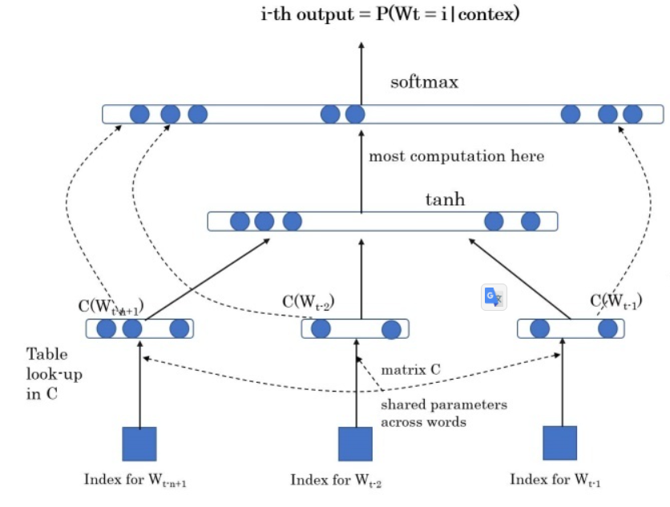

​		前面的任意单词 W_i 使用独热（one-hot）编码作为原始单词输入（比如在一个词表大小为4，其中苹果为第2个单词的词表中，“苹果”的one-hot编码表示就是[0, 1, 0, 0]），如图所示，每个单词的表示都是一个维度为 1*V 的向量（V为词表大小）。之后每个单词的 one-hot 向量都乘以一个矩阵获得向量 C（W_i），再把每个单词的向量 C（W_i）拼接，送入中间的隐层神经元，然后再送入softmax 函数去预测后面应该接哪个单词。


### 词向量

​		这个 C（W_i）其实就是每个单词对应的词向量（word embedding），而从 one-hot 向量到词向量映射的这个矩阵，它的大小是 V*m，V是词表大小，m是词向量的维度（**用 1\*V 的 one-hot 向量乘以 V\*m 的矩阵，就能得到 1\*m的词向量表示**），这个映射的过程就可以理解为一个查表的过程，这个矩阵就可以理解为保存词表中所有词向量的表。只不过这个矩阵也是网络参数，也需要通过训练来获得，训练开始时用随机值初始化该矩阵，当这个网络训练好后，矩阵的内容被正确赋值，每一行代表一个单词对应的词向量。

​		

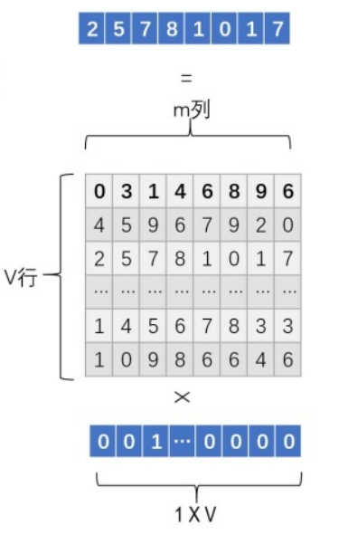

​		通过神经网络语言模型对大量的语料进行学习，不仅能够实现其本身的任务（通过上文预测下一个词），还能够得到一个词向量矩阵，而**通过这个词向量矩阵我们能够把一个单词从稀疏的 one-hot 向量映射到一个稠密的词向量表示上**，而这个词向量矩阵能够拿到下游任务上作为初始化模型编码层的参数（等同于把这个词向量作为下游任务的输入），这个过程是不是和我们在上面提到的利用 ImageNet 进行预训练的过程非常相似。

​		这种词向量的学习方式，就是自然语言处理领域最早的预训练方法，词向量本身就是通过大量的文本和一个语言模型训练出来的一个结果，然后拿来用于下游任务上作为输入，所以词向量本身就是预训练模型的一种，只不过它不是一个深度的模型，只是一个浅层的模型。

​		再介绍一个词向量经典的工作，2013年大火的**word2vec**。word2vec的网络结构和上面提到的神经网络语言模型类似，但是它们之间的训练方法有所不同，如下图所示，word2vec有两种训练方法，如下图所示，一种叫**CBOW**，核心思想是从一个句子里面把一个词拿掉，用这个词的上文和下文去预测被拿掉的这个词（类似于我们以前英文考试中的“完形填空”思路，而这种思路，恰恰和后来的BERT，有着极高的相似度），第二种叫Skip-gram，和CBOW正好相反，输入某个单词，让神经网络来预测上文和下文。

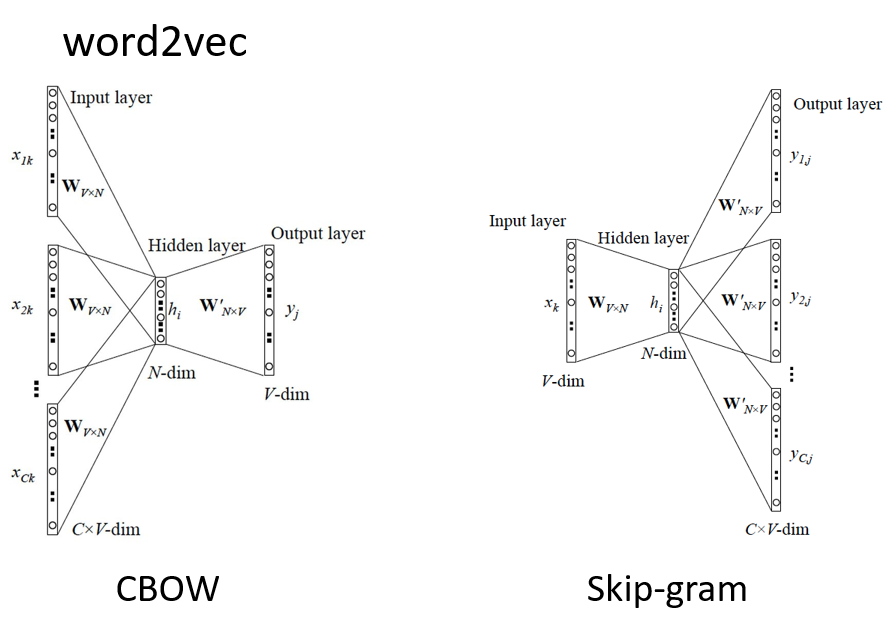

​		上面提到的神经网络语言模型是怎么训练的，是输入一个单词的上文，来预测这个词。这两种思路本身是有显著差异的。为什么会有这种差异呢？因为它们本身的起源不同，神经网络语言模型的主要任务是要学习一个解决语言模型任务的网络结构，语言模型就是要看到上文预测下文，而词向量只是顺带产生的一个副产品。但是 Word2Vec 目标不一样，它本身的目的就是要训练出词向量，这是主产品。

​		那么我们上面说到词向量本身就是自然语言处理领域最早的预训练模式，那么它是怎么运用到下游任务中的呢？如下图所示，比如在一个问答任务中，句子中每个单词以 one-hot 形式作为输入，然后乘以学好的词向量矩阵，就直接取出单词对应的词向量了。词向量矩阵其实就是网络中 one-hot 的输入层到 Embedding 层映射的网络参数矩阵。**使用词向量等价于把输入层到 Embedding 层的网络用预训练好的参数矩阵初始化了**。

​		这跟前面讲的图像领域的低层预训练过程其实是一样的，区别无非词向量只能初始化第一层网络参数，再高层的参数就无能为力了。下游NLP任务在使用词向量的时候也类似图像有两种做法，一种是Frozen，就是词向量那层网络参数固定不动；另外一种是Fine-Tuning，就是词向量这层参数使用新的训练集合训练也需要跟着训练过程更新。

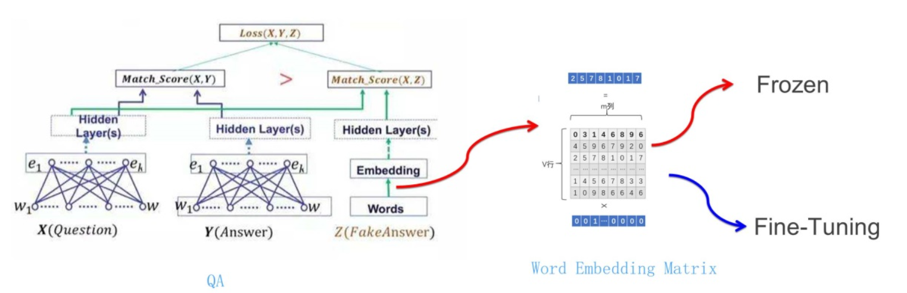

​		这就是18年以前，自然语言处理领域预训练的典型范式，词向量的使用对于很多下游任务是有一定帮助的，只不过并不像在计算机视觉领域表现得如此之好。那么，新的问题来了，为什么它的效果并不如我们期待的那么好呢？


### 词向量有什么问题

​		作为第一代的预训练方法，词向量训练本身的目标是学习到好的向量表示，然后模型本身就被丢弃了。例如上面提到的 Skip-gram、CBOW，以及后来的 GloVe。

​		但是我们再细想一下词向量运用到下游任务的过程，每个词语通过词向量矩阵映射到一个词向量，这个过程像不像一个查表的过程，我再词向量矩阵中查到这个词语对应的词向量。那么我们想想我们查字典的时候，每个词语对应的意思只有一个吗？这就是问题所在，一词多义是自然语言中经常出现的现象，也是语言灵活性和高效性的一种体现，但是它对于词向量来说，就会造成严重的负面影响。比如下面这两个句子

```
Apple has released the new Macbook.
An apple a day keeps the doctor away.
```

​		在词向量的“查表”过程中，尽管这两个“apple”的上下文不同，但是它们经过word2vec，都会得到同一个向量，换句话说，它是**上下文无关的**，那么苹果公司和苹果在运用到下游任务中时，使用的是同一个向量，这显然是不合理的，这就是它比较严重的一个问题。而且这种上下文无关的表示，无法捕捉到文本中更高级别的知识，比如语法结构，语义角色，以及指代分析。

​		还有一个问题，是OOV（out of vocabulary, 未登录词）问题，例如一个词如果不在词表中的时候，那么它的词向量就无法查到了。

​		一直以来，确实也有很多研究者提出很多方法试图解决这个问题，但是从现在来看，这些方法都太繁琐了，直到ELMo出现。


## ELMo

### ELMo

​		在之前提到，词向量本质上是个**静态**的预训练方式，所谓静态是指，训练之后每个单词的表达就固定住了， 在下游任务使用时，无论单词的上下文情况如何，这个单词的词向量不都不会因为上下文场景不同而发生改变，比如上面一个部分中举的“apple”的例子，它事先学好的词向量中包含了“苹果公司”和“一种水果”这两种语义，但是在运用到下游任务时，即便从上下文中可以看出它代表的是“苹果公司”，但是对应的词向量的值是不会变的，它还是混合了多种语义。所以它是“静态”的，也可以说它**上下文无关的**语言表示，这就导致它无法有效地解决一词多义问题和捕捉更高级的语言信息。那么为了解决这些问题，以及基于单词天然和语境相关的考量，我们需要区分不同语境下的语义。

​		提出 ELMo 这个模型的论文题目叫做 “Deep contextualized word representation”，这个工作本身的关键，就在于**context**，context 是上下文（语境）的意思，ELMo的本质思想就是，它让输入到下游任务的预训练词向量并不是静态的，而是上下文相关的。

​		它是如何做到的呢，它也需要训练好一个语言模型，但是和之前的做法不同的是，它并不是抛弃掉模型只保留里边的词向量矩阵，而是把整个模型保存了下来。在运用到下游任务时，并不是按照之前查表的方式来初始化词向量，而是把整个句子输入模型中，此时的句子中的每个单词已经具备了上下文语境，再根据上下文的调整，来输出每个单词的词向量表示。这样经过调整后的词向量就更能表达在这个语境下的含义，自然也就解决了一词多义的问题。

​		ELMo 的预训练过程如下图所示，它的网络结构采用了双层双向的 LSTM，基础的语言模型的任务是根据单词 W_i 的上文去正确预测这个单词 W_i，W_i 之前的单词序列称为上文，之后的单词序列称为下文。图中左侧的前向双层 LSTM 代表正方向的编码器，输入是从左到右 W_i 之前的上文（用单词的上文来预测该单词），右侧的反向双层 LSTM 代表反方向的编码器，输入是从右到左 W_i 之后的下文 （用单词的下文来预测该单词）。使用这个网络结构用大量的语料进行自监督的训练，就完成了预训练的过程。

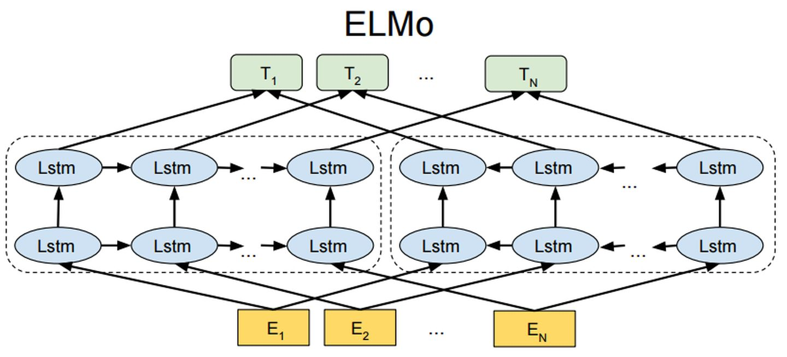

​		预训练好这个网络之后，输入一个新的句子，句子中的每个单词都能得到对应的三个向量表示：最底层是单词的词向量，第一层双向LSTM的结果，和第二层双向LSTM的结果。最底层的词向量和上一部分所说的相似，也可以拿来直接作为下游任务的输入，只不过这种方式是静态的，存在上下文无关所导致的问题。而第一层和第二层LSTM的输出的向量，我们可以看到它**编码了整个序列的信息**，此时每个单词位置的向量，就是上下文相关的了，这个结果的表示，我们可以认为它包含了更多这个词语在语境下的含义。

​		也就是说，ELMo 不仅学会了单词的词向量（最底层），还学会一个能够在具体上下文语境下对每个词向量进行调整的双层双向 LSTM 模型。这就是 ELMo 的预训练阶段。

​		那么预训练好网络之后，在下游任务上，如何使用了。如下图所示，比如在做问答任务时，对于此时的问题 X，我们可以先将句子 X 作为预训练好的 ELMo 的输入，这样 X 中的每个单词在 ELMo 中都能获得对应的三个向量值，再将这三个向量进行加权求和（三个向量的权重应该作为下游任务的一个可学习参数在 fine-tune 过程中进行学习），然后将这个整合后的向量作为句子 X 在问答任务的对应模型中相应的输入。对于问答任务中的答案句 Y 的操作也和前面一样。

​		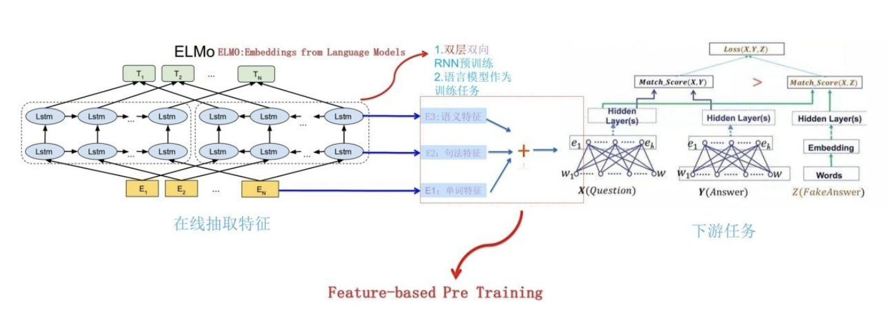

​		那么 ELMo 解决了静态词向量无法解决的一词多义问题了吗？解决了，看下面这张图，ELMo 的论文中给出了这样一个例子，对于 Glove 训练出来的静态词向量，play 这个词与其词向量最接近的其他单词基本集中在和体育相关的方面，这是因为训练数据中包含 play 的语料大部分和体育领域相关；但是使用 ELMo，根据上下文调整得到的动态词向量，成功找出了和我们需要的“演出”有着相同语义的句子。

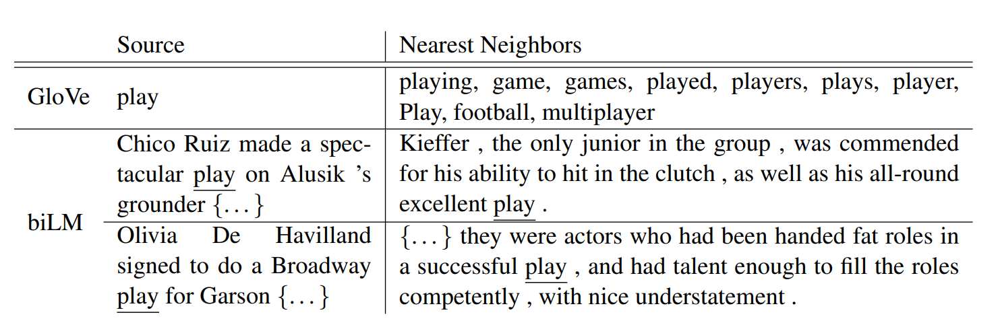

​		ELMo 最终在6个不同的自然语言处理任务上性能都有不同幅度的提升，而且覆盖面较广，包含语义关系，分类任务，阅读理解等多个领域，说明它的普适性非常好。


### 对比

​		那么 ELMo 还有哪些问题呢？

​		首先，ELMo 在抽取训练语料特征的时候，选择的是 LSTM 而不是 Transformer，这就存在两个问题，第一，**LSTM 作为 RNN 的一种变体，存在天然的局限，无法训练得很深**（ELMo 仅仅使用了两层的 LSTM），这就使得其在特征提取上，不如能够加深层次的 Transformer；其二，LSTM 在并行度上完全无法和 Transformer 相提并论，导致它本身训练的效率要比基于 Transformer 的模型要低。

​		 其次，ELMo 虽然利用了双向的信息，但是它的“双向”，仅仅只是使用了双向的LSTM，然后在模型的最高层进行了一个拼接，这种双向和 Transformer 的自注意力机制的双向比，还是差了一点，对于语义的提取效果就会更差。

​		在 BERT 和 GPT 之前，对比计算机视觉和自然语言处理领域在早期预训练的路径选择上，有两点不同：1、计算机视觉使用的是**有监督**训练（ImageNet），自然语言处理使用的是**自监督**训练。2、计算机视觉能够采用**深度的模型**，自然语言处理的预训练**模型都比较浅**。

​		而在谷歌的 Transformer 问世之后，基于 Transformer 的模型框架，在自然语言处理领域，衍生出了一系列深度的预训练模型，这其中就包括，诞生于2018年的 **GPT** 和 **BERT**。


## GPT 和 BERT

### GPT

​		GPT（Generative Pre-Training），生成式预训练。GPT 的预训练过程和 ELMo 类似（自监督训练），但是 GPT的特征抽取器用的是**Transformer 的解码器**，并且虽然 GPT 的目标任务也是语言模型，但是它是单向的（在语言模型这个任务中，GPT 预测每一个位置的单词时只使用了单词的上文信息，而 ELMo 则使用了下文信息）。GPT 的模型结构如下图所示。

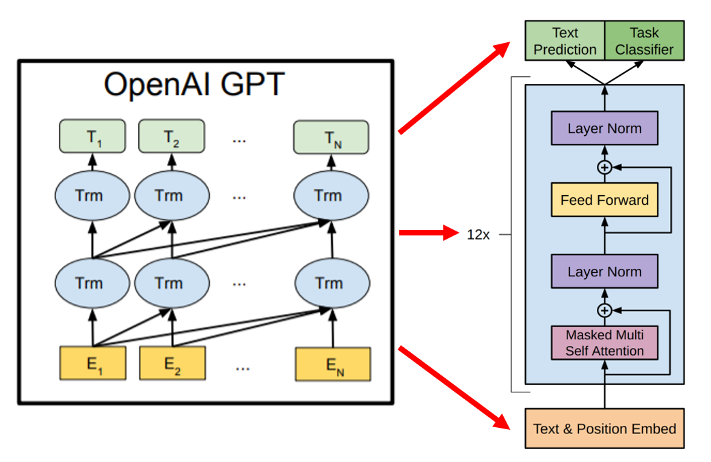

***

- Transformer 的编码器和解码器

  ​		我们在提到一个基于 Transformer 的模型的时候，如果说这个模型使用的 Transformer 的解码器（Decoder），比如 GPT，那么就表示这个模型的特征提取模式是单向的，其模型结构只使用了 Transformer 架构的解码器部分（如下图的解码器）；如果说这个模型使用的是 Transformer 的编码器（Encoder），比如 BERT，那么就表示这个模型的特征提取模式是双向的，其模型结构只使用了 Transformer 架构的编码器部分（如下图的编码器）。

  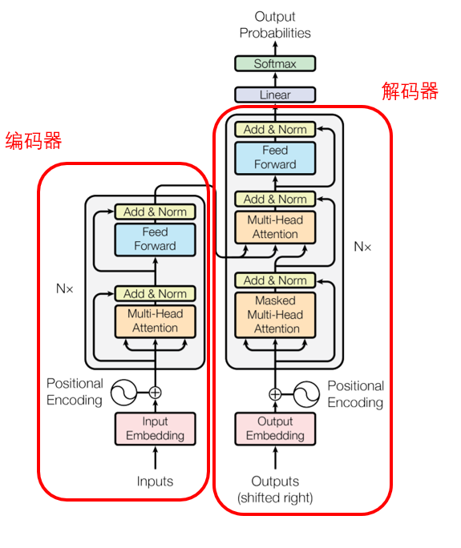

  ​		它们之间主要的不同是，编码器结构在编码每一个位置上的元素时，是不会遮住后面位置的元素（mask）的，所以在编码每个位置时，都能利用到整个句子的信息，所以是双向的；而解码器结构的作用是生成，所以在编码每个位置的元素时，是会对后面的位置的元素进行掩码（mask），每个位置的元素能利用的信息只有它左边的元素，所以是单向的。

***

​		如果使用 GPT 作为预训练模型，那么在做下游任务时，就不能任意地设计自己的网络结构了，**必须使用 GPT 的网络结构作为下游任务的结构**。此时，我们使用通过自监督训练好的网络参数初始化模型参数，然后再用**有监督的数据**，对模型进行 fine-tune，使得模型更适合解决当前问题。这个过程和前面提到的图像领域的预训练，模式是完全一样的。

​		这里引入了一个新的问题，怎么样才能让各种不同的下游任务，都使用 GPT 的网络结构呢？如下图所示，GPT 的论文中提出了针对不同任务的修改方式，对于分类任务只要对文本加上起始和终结符号即可；对于文本蕴含问题，只要在句子中间加个分隔符即可；对于文本相似度判断的问题，还是再中间加个分隔符，并且把两个句子顺序对调，进行两次输入即可（体现顺序的无关性）；对于多项选择问题，则将多个答案和文本进行拼接，中间加上分隔符，然后进行多路输入。这样就能使 GPT 模型适应大部分的下游任务。


​		GPT 在12个自然语言处理领域的任务中的9个上取得了当时 SOTA，鉴于这种预训练模式的普适性如此之强，效果还如此之好，在当时也获得了较大的影响力，但是马上诞生的 BERT 很快抢去了一切风头。

### BERT

​		那么为什么是 BERT 最终成为了自然语言处理领域预训练的代表作，成为2018年自然语言处理领域里程碑式的作品呢？

​		首先来看看 BERT 在模型训练上做了什么创新，我们在上面提到了，GPT 采用了单向的 Transformer（解码器）作为特征提取器，ELMo 利用了双向的文本信息进行训练。那么如果既要用Transformer 作为特征提取器，又要利用双向文本信息，应该怎么做呢？在语言模型预训练上，他们不再使用标准的从左到右预测下一个词作为目标任务，而是提出了两个新的任务。

#### MLM 和 NSP

​		首先是**MLM（masked language model）**任务，在前面 word2vec 的部分，提到过 **CBOW** 的训练方法，它的核心思想是：在做语言模型任务的时候，把要预测的单词遮住，然后根据上下文来预测。MLM任务就是这么做的，随机选择语料中15%的单词，把它们遮住，也就是用 [MASK] 来代替原始单词（如下图第一点所示），然后要求模型去正确地预测这个被遮住的单词。但是这个时候有个问题，在实际应用场景中，句子里边是没有 [MASK] 这个标签的。为了缓解这个问题，BERT 做了一个改造，如下图所示，在15%被选中遮住的单词中，有80%被替换为 [MASK]，有10%随机被替换为词表里的另外一个词，剩下10%不变。

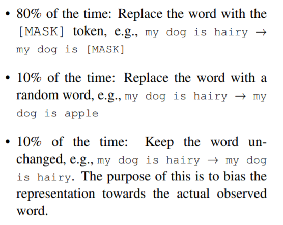

​		第二个任务是 **NSP（next sentence prediction）**任务，这个任务就是一个二元分类问题，如下图所示，在做预训练的时候，有50%的几率，输入是一个句子和下一个句子的拼接，分类标签是正例（代表第二个句子是第一个句子的后续），而另外50%的几率，输入的是一个句子和句子库中随机的另外一个句子的拼接，标签为负例（代表第二个句子不是第一个句子的后续）。之所以这么做，是考虑到有一部分下游任务是句子关系判断任务，单词预测粒度的训练到不了句子关系这个层级，增加这个任务能让模型普适性更强。

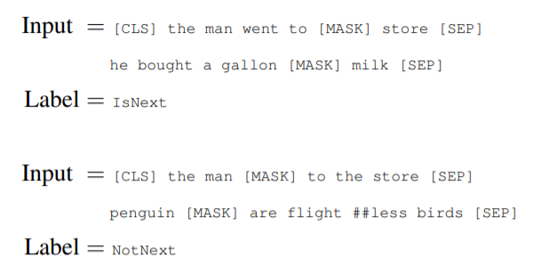

#### 输入和输出

​		如下图所示，BERT 的输入端一共包含三类向量表示：

​		1、词表示，Token Embeddings，单词级别的表示，输入的是每个单词在词表中的id。

​		2、分隔表示，Segment Embedding，句子级别的分隔表示，比如第一个句子的 segment id 都是0，第二个句子都是1。

​		3、位置表示，Position Embedding，位置表示，Transformer 这篇论文中有提到，用于加入时序信息，弥补自注意力机制不包含时序信息的缺失，不同于 Transformer 使用的是正余弦函数进行映射，在 BERT 中使用的是可学习的参数表示。

​		把这三个输入编码得到的向量表示进行相加，就得到了 BERT 的输入。

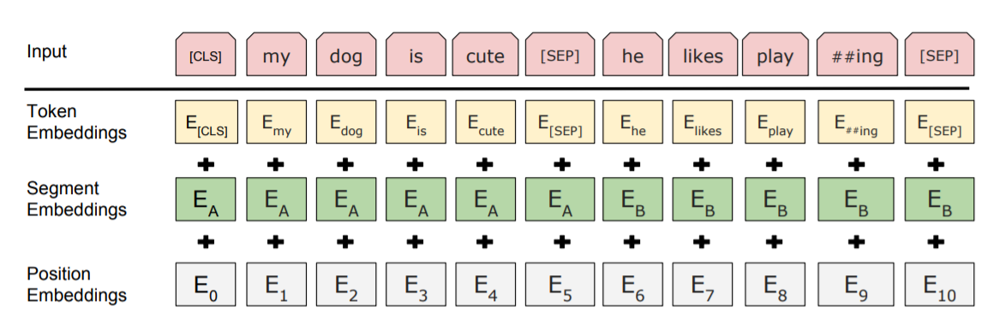

​		将输入送入多层堆叠的 Transformer 编码器中，最终每个位置都会得到一个相应的隐层向量，第一个位置 [CLS] 的隐变量代表NSP任务的分类结果，每个 [MASK] 位置的隐变量代表该位置的词语表示，把这个结果和词典对应的单词矩阵相乘，计算 `E[MASK]` 和 `E[词典中的第 i 个词]` 的内积（其实就是算相似度），然后把这个结果送入 softmax 函数预测可能性最大的单词。

​		用这两个输出的结果分别用于计算 MLM 和 NSP 任务的损失值，然后把两个任务的损失值直接加起来作为整个整个模型的损失值。

#### fine-tune

​		在自然语言处理领域，对于种类繁多而且各具特点的下游任务，Bert 如何改造输入输出部分使得大部分下游任务都可以使用预训练好的模型参数呢？

​		对于句子关系类任务，如下图（a），和GPT类似，加上一个起始和终结符号，句子之间加个分隔符。对于输出来说，把 Transformer 最后一层 [CLS] 符号对应的位置上面接一个 softmax 层分类即可。

​		对于单个文本分类问题，如下图（b），只需要增加起始和终结符号，同样是把 Transformer 最后一层 [CLS] 符号对应的位置上面接一个 softmax 层分类。

​		对于如问答这类生成任务，如下图（c），同样也是增加起始和终结符合，在问题和文本之间增加一个分隔符，在输出的部分可以直接在最后一层 Transformer 上加一个生成模型，像 seq2seq 任务一样产生输出。

​		对于序列标注问题，如下图（d），输入部分和单句分类是一样的，输出部分在最后一层 Transformer 上接一个softmax，对每个位置都进行分类。

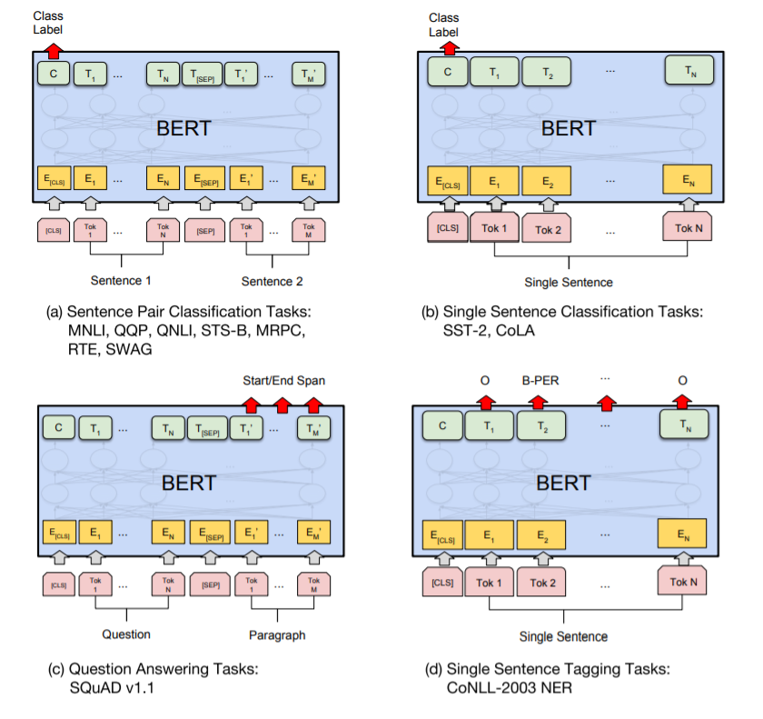

​		BERT 最终在11个各种类型的NLP任务中达到当时的 SOTA，对于某些任务性能有极大的提升。最终成为席卷自然语言处理届的风暴，改变了整个行业的格局。


### 对比

​		2018年，诞生了 ELMo、GPT、BERT 这三个改变自然语言处理领域格局的伟大工作，我们来看看这三个工作的区别。

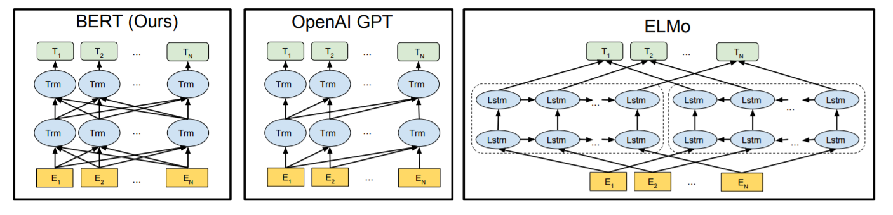

​		从特征提取器方面，BERT 使用的是双向的 Transformer（也就是 Transformer 的编码器）作为特征提取器，GPT 使用的是从左到右的 Transformer（也就是 Transformer 的解码器）作为特征提取器，ELMo 使用的是双向 LSTM 作为特征提取器，虽然也是双向的，但是它的双向是体现在在两个单向的多层 LSTM 顶端做一个拼接。

​		从模型深度方面，GPT 和 BERT 是基于 Transformer 的模型，能够把深度加到比较深，GPT 使用了 12层的 Transformer，BERT 的两个版本分别使用了12层（BERT base）和24层（BERT large）的 Transformer。而 ELMo 仅仅是双层的 LSTM，只能算一个浅层的神经网络，在特征提取上存在一定的局限性。

​		所以我们可以看出，BERT 最关键的两点，一是采用了 Transformer 作为特征抽取器，二是在预训练的时候采用双向语言模型，并且巧妙地使用了类似CBOW的“完形填空”模式。可以说，BERT 是自然语言处理方向几大重要进展的优势的集大成者。

​		

## 发展

### RoBERTa

​		可以把 BERT 视为一个半成品，RoBERTa 才是遵循 BERT 的思路的最终完成品。BERT 的模型训练不够充分（没收敛），所以 RoBERTa 可以看做一个加强版的 BERT。

​		

​		RoBERTa 和 BERT 相比：

​		1、增加了预训练的数据量

​		2、延长预训练时间或者增加预训练步数

​		3、放大预训练过程的 Batch Size（256 -> 8000）

​		4、只用MLM，不用NSP

​		5、动态mask


### MASS

最早明确提出使用Encoder-Decoder结构做通用领域预训练的，就是微软提出的MASS模型


### ELECTRA

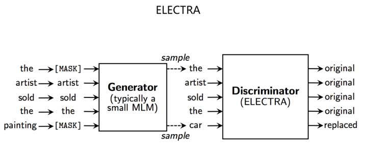

​		ELECTRA，这是一个比较独特的预训练方法(参考上图)。 它形式上采取了类似GAN的模式，但是本质上并非GAN，因为缺乏GAN最关键的生成器和判别器的对抗训练过程。ELECTRA联合训练了小的生成器以及大的判别器，**它强迫判别器对生成器产生的所有单词，做个是否经过改写的判断，这无疑增加了模型的学习效率，因为原先的MLM只学习15%的被Mask单词，而ELECTRA对所有单词都要进行判断，并从中学习**。ELECTRA论文做了分析，模型的绝大多数收益来自于全部单词参与训练这一步。这意味着，ELECTRA这种所有单词全员参与训练过程的模式，能够在其它条件相同的情况下（模型复杂度，数据量等），使得模型获得更高的学习效率，这个结论和做法还是很有价值的。本质上，ELECTRA这种提升模型效率的方法，和其它模型的各种做法，是相互互补的。就是说，在ELECTRA的训练模式下，增加训练数据、增加模型规模、模型充分训练，有可能获得更好的模型效果。


## 模型结构比较

- **Encoder-AE结构**

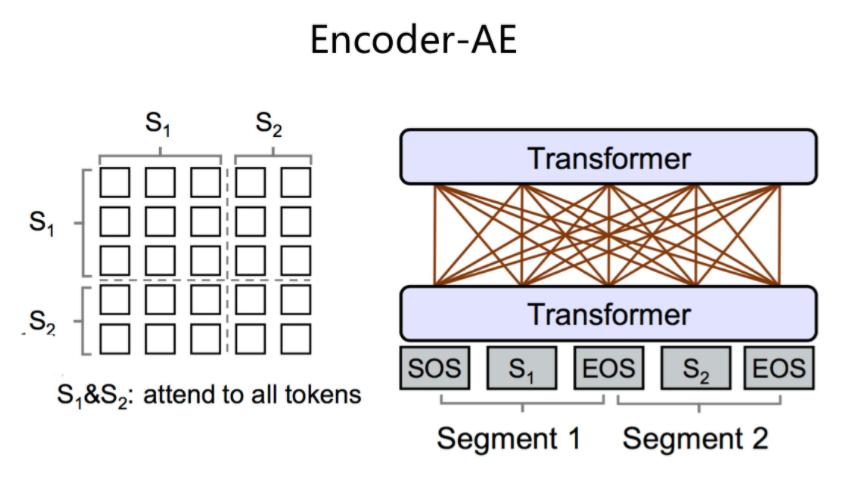

​		包括原始版本Bert在内的，大多数后续改进模型采取的结构。整个结构就是一个标准的Transformer，在语言模型预训练的时候，采用AE方法。也就是说，输入句中的未被Mask的任意单词两两可见，但是被Mask掉的单词之间都相互独立，互不可见。在预测某个被Mask掉的单词的时候，所有其它被Mask的单词都不起作用，但是句内未被Mask掉的所有单词，都可以参与当前单词的预测。可以看出，Encoder-AE是个采用双向语言模型的单Transformer结构。

​		对于语言理解类的NLP任务，这种结构都是效果最好的，但是对于语言生成类的任务，这种结构效果相对很差。也就是说，这种结构比较适合做语言理解类的任务。

- **Decoder-AR结构**

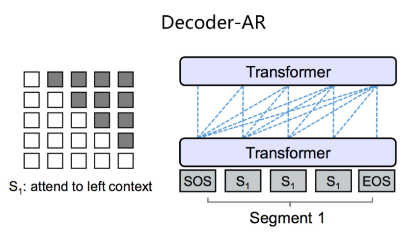

​		和Encoder-AE结构相同，都是采用单个的标准Transformer，主要区别在于：语言模型预训练的时候，采用AR方法，就是从左到右逐个生成单词，第 $i$ 个单词，只能看到它之前的第1到第 $i-1$ 个单词，不能看到后面的单词。采用这种结构的典型模型就是GPT1、GPT2、GPT3系列了。GPT3在文本生成任务方面的表现，确实是出乎意料地好。当然，这不能仅仅归功于这个结构本身，更复杂的模型和更大量的数据可能是主因。Decoder-AR结构是个单向语言模型的单Transformer结构。

​		除了Encoder-Decoder结构外，貌似对于语言生成类的任务，这种结构是效果最好的结构之一。但是相应的，语言理解类的任务，采用这种结构，效果比Encoder-AE结构差距非常明显，这也好理解，因为只看到上文看不到下文，对于很多语言理解类任务而言，信息损失很大，所以效果不好也在情理之中。也就是说，这种结构比较适合做语言生成类的任务。

- **Encoder-Decoder结构**

​		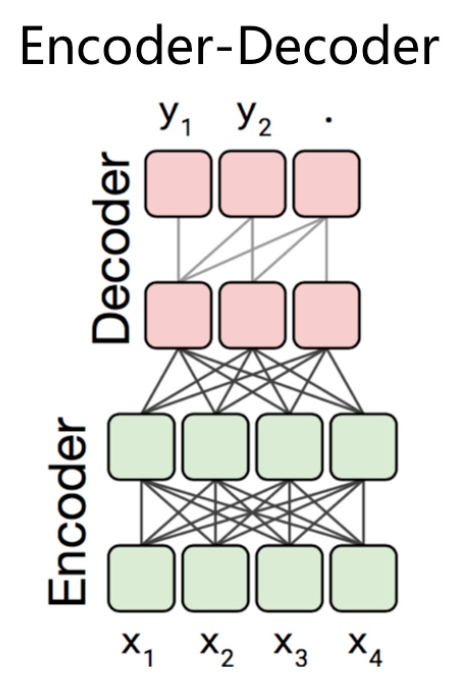

​		这种结构在Encoder侧，单独使用一个Transformer，采用了Encoder-AE的结构。也就是说，编码阶段采用双向语言模型，任意两个单词两两可见，以更充分地编码输入信息；而在Decoder侧，使用另外一个Transformer，采用了Decoder-AR结构，从左到右逐个生成单词。

​		当然，Decoder侧和标准的Decoder-AR不同的地方还是有的：Decoder侧生成的单词，除了像Decoder-AR结构一样能看到在它之前生成的单词序列外，还能看到Encoder侧的所有输入单词 。而这一般是通过Decoder侧对Encoder侧单词，进行Attention操作方式来实现的，这种Attention一般放在Encoder顶层Transformer Block的输出上。

​		在进行预训练的时候，Encoder和Decoder会同时对不同Mask部分进行预测：Encoder侧双向语言模型生成被随机Mask掉的部分单词；Decoder侧单向语言模型从左到右生成被Mask掉的一部分连续片断。两个任务联合训练，这样Encoder和Decoder两侧都可以得到比较充分地训练。

​		从目前对比实验看，无论是语言理解类的任务，还是语言生成类的任务，Encoder-Decoder结构相对其它几种结构来说，效果都是最好的之一。而且，它有另外一个优点，就是用这个结构，可以同时做生成类和理解类的NLP任务，基本做到了不同任务在模型结构上的统一，这点还是很好的，一个结构可以到处使用，比较方便。但是，它也有个问题，因为两侧各用了一个Transformer，所以相对其它结构参数量翻倍，计算量也增加了，就是说比其它模型笨重。而且，Encoder-Decoder结构比其它结构效果好，很可能主要原因来自于参数量增加导致的模型容量增大。目前，采用这个结构的效果很好的模型包括Google T5以及BART等模型。

- **Prefix LM**

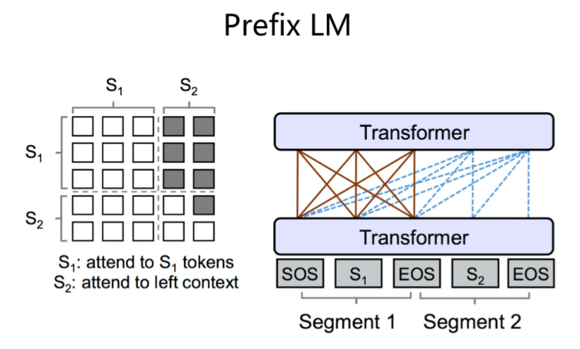

​		Prefix LM结构是Google T5论文中给出的叫法，这种结构最早由UniLM模型提出，我们沿用Google T5的这种称谓。如果深入分析的话，Prefix LM其实是Encoder-Decoder模型的变体：标准的Encoder-Decoder模型，Encoder和Decoder各自使用一个独立的Transformer；而Prefix LM，相当于Encoder和Decoder通过分割的方式，分享了同一个Transformer结构，Encoder部分占用左部，Decoder部分占用右部，这种分割占用是通过在Transformer内部使用Attention Mask来实现的。与标准Encoder-Decoder类似，Prefix LM在Encoder部分采用AE模式，就是任意两个单词都相互可见，Decoder部分采用AR模式，即待生成的单词可以见到Encoder侧所有单词和Decoder侧已经生成的单词，但是不能看未来尚未产生的单词，就是说是从左到右生成。

​		目前的一些对比实验证明，在其它条件相同的情况下，关于语言理解类的任务，Prefix LM结构的效果要弱于标准Encoder-Decoder结构。这里是值得深入思考下的，因为看上去Prefix LM和标准的Encoder-Decoder结构是等价的。那么，为什么它的效果比不过Encoder-Decoder结构呢？一方面的原因估计是两者的参数规模差异导致的；另外一方面，可能与它这种模式的Decoder侧对Encoder侧的Attention机制有关。在Decoder侧，Transformer的每层 Block对Encoder做Attention的时候，标准的Encoder-Decoder模式，Attention是建立在Encoder侧的最后输出上，这样可以获得更全面完整的全局整合信息；而Prefix LM这种结构，Decoder侧的每层Transformer对Encoder侧的Attention，是建立在Encoder的对应层上的，因为这种模式的Encoder和Decoder分割了同一个Transformer结构，Attention只能在对应层内的单词之间进行，很难低层跨高层。这可能是影响这种结构效果的原因之一。

​		关于语言生成类的任务，Prefix LM效果虽然要弱于Encoder-Decoder结构，但是总体而言，两者相差不大，相对其它模型，Prefix LM结构在生成类任务表现也比较突出。

​		Prefix LM因为是Encoder-Decoder的变体，所以可以看出，它的优势也在于可以同时进行语言理解和语言生成类任务，而且相对Encoder-Decoder来说，因为只用了一个Transformer，所以模型比较轻，这是Prefix LM的优势。缺点则是在效果方面，貌似要弱于Encoder-Decoder模型的效果，语言理解类任务相对有明显差距，生成类任务的效果相差不大。

- **Permuted Language Model**

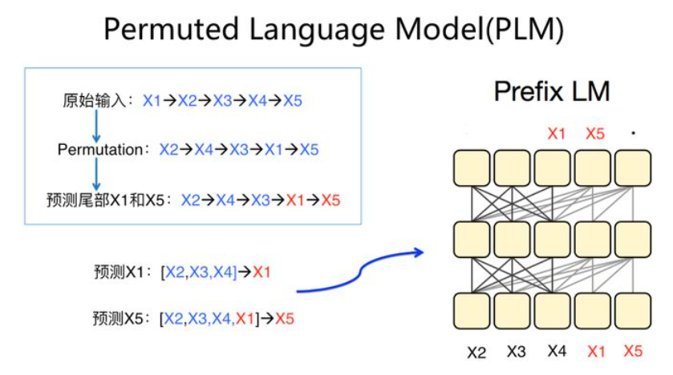		

​		PLM最早是在XLNet的论文中提出的，目前有些后续模型也在PLM上进行改进。

​		PLM一样采用单个Transformer模型作为主干结构，但是从训练方法上来说，是个很另类也很有创意的做法，是种“形为AR，实为AE”的做法。在语言模型预训练过程中，它看上去遵循AR从左到右的输入过程，这符合一般生成任务的外在表现形式，但是在内部通过Attention Mask，实际做法其实是AE的做法，无非是把AE的做法隐藏在Transformer内部。它和AE从细节来说，主要有两个区别：首先，预训练过程中，输入句子去掉了Mask标记，改为内部Attention Mask，以保持预训练过程和下游任务Fine-tuning的一致性。关于这一点，目前有实验证明这个虽然有积极影响，但是影响不大（ELECTRA针对预训练过程是否带Mask 标记做了效果对比，带Mask标记的Bert模型GLUE得分82.2，去掉Mask标记利用其它单词代替的对比模型GLUE得分82.4）；其次，也是它和AE的最主要区别，PLM认为被Mask掉的单词之间是相互有影响的，先产生的被Mask掉的单词，应该对后生成的被Mask掉的单词，在预测的时候发生作用，而标准的AE则认为被Mask掉的单词是相互独立的，相互之间不产生作用。

​		如果仔细分析下PLM的预训练过程，会发现本质上PLM是Prefix LM的一种变体。上图给出了个例子来说明这种情况，对于某个输入句子，PLM首先会进行单词顺序随机变换，然后选定变换后句子的末尾一部分单词进行Mask，被Mask的单词预测顺序是有序的，按照变换后在句中先后顺序来预测，上面例子中会先预测 $x_1$，然后再预测 $x_5$。在预测 $x_1$ 的时候，未被Mask的上下文 $x_2,x_3,x_4$ 会对预测 ![[公式]](https://www.zhihu.com/equation?tex=x_%7B1%7D) 有帮助；假设已经预测并输出了 $x_1$，在预测的 $x_5$ 时候，未被Mask掉的上下文 $x_1,x_3,x_4$ 以及刚预测出的 $x_1$，会对预测 $x_5$ 有帮助。其实你想 ，这等价于什么？等价于以 $x_4$ 作为边界切割开的Prefix LM模型，Encoder端包含 $x_2,x_3,x_4$，Decoder侧包含 $x_1,x_5$，在预测 $x_5$ 的时候，不仅能看到Encoder侧的所有输入，也能看到Decoder侧之前的输出 $x_1$ 。当然，因为每个输入句子的长度各异，被Mask掉的单词个数也不固定，所以看上去Encoder和Decoder的边界根据输入句子，边界是在动态变化的。所以，PLM其实是一种边界变化的Prefix LM变体结构。

​		如果不考虑XLNet里的其它因素，单纯看PLM结构的话，目前有些对比实验，貌似PLM在语言理解类任务中，效果不及Encoder-AE；在语言生成类任务中，效果略微优于Encoder-AE，但是距离Decoder-AR差距较大。在两类任务中，都有点上不着村，下不着店的感觉，就是都还可以，但都不够好的感觉。XLNet效果确实是很好的，但是，这说明XLNet效果好，真正起作用的貌似不是PLM，而是其它因素。


​		从模型效果来看，Encoder-Decoder结构无论在语言理解类还是语言生成类任务中，都是效果最好的。当然，效果好的原因很可能在于模型参数多，模型容量大，而不一定是自身结构带来的优势。它的优点一个是效果好，一个是能够将理解和生成任务统一在一个框架下；缺点是参数多计算多，所以模型比较重。采用这个结构的代表模型包括Google T5和BART。

​		因为Encoder-Decoder模型比较重，所以，如果从相对轻量结构里进行选择的话，对于语言理解类任务，Encoder-AE结构相对而言效果较好，代表模型很多，典型的比如ALBert、RoBERTa；对于语言生成类任务，Decoder-AR结构和Prefix LM结构相对而言效果较好，都可考虑，Decoder-AR的代表模型是GPT系列，Prefix LM的代表模型是UniLM。语言理解类任务应该用AE任务，语言生成类任务应该用AR任务，这点也很明确了。


## 提升模型效果的因素

- **更高质量、更多数量的预训练数据**

​		关于预训练数据对模型效果的影响，Google T5做了大量对比实验，目前的结论，如果归纳一下的话，应该是这样的：在保证预训练数据质量的前提下，数据规模越大模型效果越好。这里需要注意的是，数据规模越大越好，这点其实从Bert一出来，就是一个容易想到的重要因素。因为数据量越多，数据里蕴含的知识也越多，那么模型能学到的东西越多，所以模型效果会更好，这是一个靠简单推理就能得出的结论。但是，它是有前提的，前提是数据质量要高，光数据量大不行，很多乱七八糟的数据，反而会对模型效果带来负面影响。

- **增加模型容量及复杂度**

​		所谓增加模型容量及复杂度，指的是增加Transformer模型的参数量，一般而言，模型容量越大，模型的表达能力越强。最直接的增加模型容量的方式就是增加Transformer Block层深，比如可以从Bert base的12层，增加到Bert Large的24层，还可以继续增加到比如36层，这是纵向增加复杂度，Google T5走的这条路。除此外，还可以横向增加模型复杂度，比如在固定Transformer层深的情况下，可以通过放大Transformer中构件的大小，比如Hidden Size的增大，FFN层对隐层的放大，Multi-Head Self Attention的Attention头的增加，等多种方式来做到这一点。ALBERT走的这条路，它的xxLarge模型效果最好，只用了12层Transformer Block，但是Hidden Size达到了4096。

​		这两种模式还可以相互结合，就是同时纵向和横向增加模型复杂度，GPT 3即是如此，将模型复杂度这点推到了极致。单词特征的Embedding不会放的太大，一般采用64或者128大小，ALBERT证明了如果单词特征Embedding跟着Transformer内部的Hidden Size同步放大，效果反而会降低。也就是说，增加模型容量指的是放大Transformer模型本身的参数量，但不包括输入层Embedding的参数。

- **更充分地训练模型**

这里所谓的“更充分”，一般指的是放大Batch Size、增加预训练步数，就是RoBERTa做的那两个事情。

- **有难度的预训练任务**

​		原始的Bert预训练，有两个训练任务：一个是单词级的Mask语言模型MLM，一个是句子级的下一句预测任务NSP。RoBERTa证明了NSP对于模型效果没什么影响，所以拿掉了这个任务。

​		如果归纳一下的话，应该是这样的：对于单词级的Mask语言模型来说，Span类的预训练任务效果最好。所谓Span类的任务，就是Mask掉的不是一个独立的单词，而是一个连续的单词片断，要求模型正确预测片断内的所有单词。Span类任务，只是一个统称，它会有一些衍生的变体，比如N-Gram，就是Span模型的一个变体，再比如Mask掉的不是单词而是短语，本质上也是Span类任务的变体，这里我们统称为Span类任务。

​		目前有相当多的研究证明Span类任务是效果最好的，最近有些工作进一步说明，Span内多个单词独立被生成效果会更好。所谓独立生成，举个例子，假设被Mask掉的片断是：$x_1,x_2,x_3$ ，之前一般Span类的预训练是顺序生成片断内的单词，就是先生成 $x_1$  ，然后据上下文 $x_1$ ，生成 $x_2$，这么个顺序，就是说序列生成片断内单词。而独立生成，就是根据上下文，同时生成 $x_1$ , $x_2$ 和 $x_3$，被生成的单词之间无影响。所以目前单词级的Mask语言模型，独立生成的Span类任务，应该是目前效果最好的。

​		对于句子级的任务，NSP任务学习两个句子是否连续句：正例由两个连续句子构成，负例则随机选择一句跟在前一句之后，要求模型预测两者是否连续句子。本质上，NSP在预测两个句子是否表达相近主题，而这个任务，相对MLM来说，过于简单了，导致模型学不到什么知识。ALBERT采用了句子顺序预测SOP（Sentence Order Prediction）：跟NSP一样，两个连续出现的句子作为正例，但是在构造负例的时候，则交换句子正确顺序，要求模型预测两个句子出现顺序是否正确，这样增加任务难度，StructBERT也采取了类似的做法。实验证明SOP是有效的句子级预测任务。

​		总而言之，目前证明Span类任务是有效的单词级任务，SOP是有效的句子级任务。目前看，预训练任务越有难度，则预训练模型越能高效率地学习知识，所以寻找更新的更有难度的预训练任务是有较大探索空间以及成功可能的。

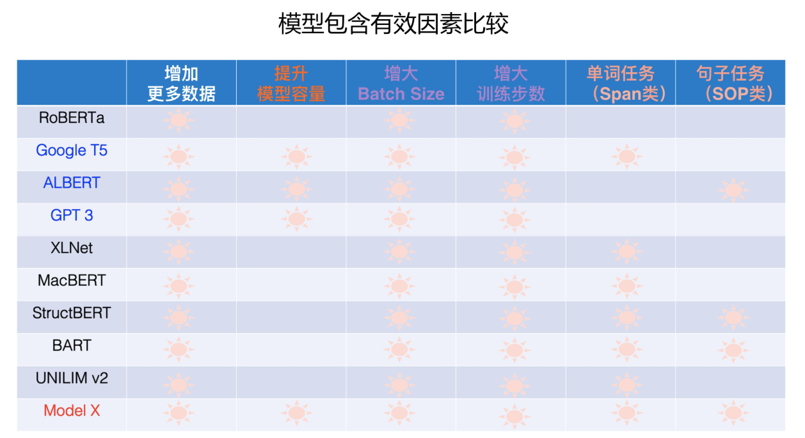


## 发展方向

​		目前很多研究表明：大多数改进新模型带来的提升，根本比不过提升数据质量数量的同时扩充模型容量带来的收益。而一些新模型的有效性，在数据量小的时候可能是有效的，但很可能发生的一幕是，当数据增大模型容量加大后，很多改进不再有效。也就是说，目前很多新模型的作用，很可能是增加了特殊类型的语言知识的编码和泛化能力，但是，这是完全可以通过增加数据数量和质量，并加大模型来达成的，这种方式又比较简单直观。


## 知识

​		大多数预训练模型是从自由文本中学习语言知识。但是，很明显，我们能让模型学的，肯定不止自由文本这一种类型。理论上，任何包含知识的数据，都有些先验知识可供预训练模型学习。我的感觉，预训练模型的发展，会越来越像人脑，日益变成一个黑盒子。就是说，我们可以通过一定手段，喂给它数据，它就会学会其中包含的知识。但是，它是怎么学会的，学到了什么，这很可能对我们来说，会越来越难以理解，就是说，随着预训练模型学习领域的拓展，这个黑盒子，可能会越来越黑。


### 显式知识的引入


#### 百度ERNIN

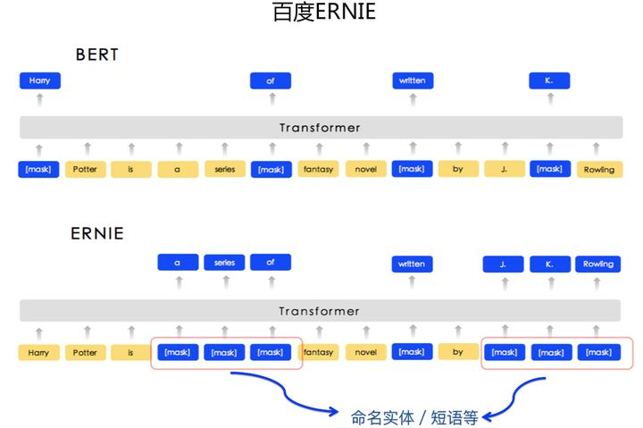

​		百度ERNIE的思路是：在预训练阶段被Mask掉的对象上做文章，我们可以使用比如命名实体识别工具／短语识别工具，将输入中的命名实体或者部分短语Mask掉（参考上图），这些被Mask掉的片断，代表了某种类型的语言学知识，通过这种方式，强迫预训练模型去强化地学习相关知识。

#### 清华ERNIN


​		清华ERNIE则是另外一种思路：我们已经有些结构化知识或者实体关系知识等现成的外部知识库，可以在预训练的过程中，通过工具找出句中的命名实体，句中的命名实体可以触发知识库中其它相关实体，然后预训练模型通过特殊的结构，来融合文本和结构化知识，以进一步促进语言的理解（参考上图）。这是另外一种思路。


​		假设说我们用来预训练的数据量特别特别大，而且特征抽取器的能力特别强。理论上，结构化知识是蕴含在这些文本内的，因为我们的外部知识库也是通过技术手段从自由文本里挖掘出来的。假设上面两个条件同时能够被满足，理论上，不太需要单独再把结构化知识独立补充给Bert这类预训练模型，预训练模型应该能够直接从自由文本中就学会这些知识。但是，以我们目前的技术条件，上面两个条件完全被满足，还是有一定难度的。于是，在这种约束下，感觉独立强化知识，让Bert在编码的时候更重视这些结构化知识，看上去是有一定补充作用的。我猜测，比较高频出现的知识，已经能够通过常规的语言模型预训练能够捕获了，很可能对于那些偏冷门的知识，引入结构化知识，会对预训练模型做下游任务有直接促进作用。而可以预见的是：随着机器资源能力越来越强大，如果在第一个预训练阶段，不断加大数据数量和质量，不断增加Transformer模型容量，那么，单独补充结构化知识给预训练模型，收益可能会越来越小。当然，以目前的技术发展阶段，感觉这个事情还有空间和潜力可挖掘。当然，上面说的是通用知识，如果手上的外部知识库，领域性很强，通用训练数据中包含的相关领域数据很少，那么，直接把知识引入，对于解决问题还是很有必要的。


## 多模态预训练

​		自由文本的预训练，本质上是让模型从海量自由文本中，通过语言模型等任务，来学习其中蕴含的的语言学知识。由此自然引发的问题就是：多模态预训练也是要将某种新型的知识塞到模型参数里，那么，这是一种什么样的知识呢？本质上，多模态预训练要学习的知识是两种模态之间，或者多种模态之间，的知识单元映射关系。比如对于文字-图片这两种多模态信息来说，我们可以把图片想像成一种特殊类型的语言，多模态预训练希望让模型学会这两种不同模态之间的语义映射关系，比如能够将单词“苹果”和图片中出现的苹果区域建立起联系。或者说，希望通过将不同模态的信息映射到相同的语义空间，来学会两者之间的语义映射关系。

​		如果我们能够成功地学会这种不同媒介间的语义映射，那么就可以做很多有意思的事情，比如说句话，搜出与这句话语义相近的图片；或者反过来，输入一个图片，能够找到或者生成对应的文字描述。再比如VQA，就是给定一张图片，你可以针对图片提出一些问题，AI系统能够回答你的问题，给出正确答案。这涉及到图片-文字的跨媒体问答以及一些跨媒体的知识推理。而要想实现这种能力，如何通过预训练模型，让模型学会两种模态之间的语义映射关系就是至关重要的。

​		我们面临的第一个问题是：从什么样的数据里来学习不同模态之间的语义映射关系呢？自由文本的预训练模型，可以采纳海量无标注数据来做，然而，多模态预训练要学习不同模态信息间的语义映射关系，所以需要有标注好的“模态1-模态2”的对齐数据，比如：标注好的“文本-图片”或者“文本-视频”平行数据。只有具备跨模态对齐数据，模型才有可能从中学习不同媒介类型之间的语义映射关系。从这个角度讲，相对自由文本预训练来说，多模态预训练因为需要模态对齐训练数据，而这种数据往往是需要人工标注的，所以可获得的数据难度及成本就高了很多，明显不如文本预训练那么自由。

​		总体而言，目前的多模态预训练任务中，通常都是“双模态”预训练，常见的包括“文本-图片”、“文本-视频”、“视频-音频”等模态类型组合。其中， 相对而言，“文本-图片”类型的任务技术发展比较快，其它类型的多模态类型发展相对缓慢，我猜测这里的主要原因在于可用标注数据的差异。“文本-图片”目前有一些规模达到几十万到上百万规模的标注数据集合，典型的比如MS-COCO、Visual Gnome等，而其它类型的模态组合数据貌似缺乏大规模数据集合，这严重影响了领域技术进展。下面我们从“文本-图片”这种模态组合来宏观介绍下多模态预训练的常规做法，其它模态组合的技术方案差不太多，所缺的可能主要是标注好的模态对齐数据。

​		我们从模型结构和训练目标这两个角度来阐述。目前的大多数技术方案大同小异，主要差异在于采用了不同的模型结构及与不同训练目标的差异组合。

​		假设我们有“文本-图片”两种模态数据，需要联合学习三种预训练模型：文本模态自身的预训练模型，图片模态自身的预训练模型，以及两个模态之间的语义对齐预训练模型。从模型结构来说，目前主流的结构有两种：双流交互模型以及单流交互模型。

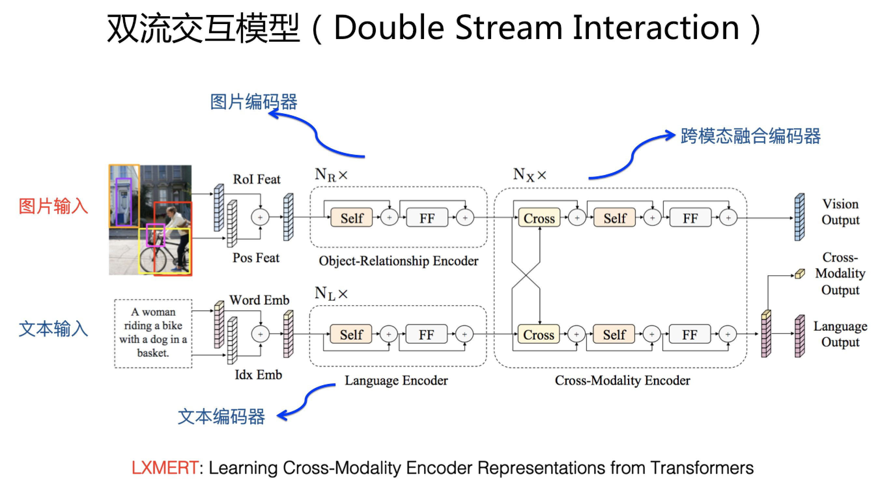

​		典型双流交互模型结构如上图LXMERT模型所示。文本编码器代表一个流，一般采用Transformer模型捕捉文本单词之间的关系；图片编码器代表另外一个流，一般也是采用Transformer模型，对于图片来说，一般用Faster-RCNN模型识别出图片中包含的多个物体及其对应的矩形位置信息，将高置信度的物体及其对应的位置信息作为图片侧Transformer的输入，用来学习图片中物品的相互关系；在两个流之上，再加入额外的Transformer模型，用于融合两个模态的语义映射关系。在这种双流结构上，模型同时学习文本预训练目标、图片预训练目标，以及图片-文本对齐预训练目标。一般文本预训练目标和标准的Bert做法类似，通过随机Mask一部分文本单词的语言模型来做；图片预训练目标类似，可以Mask掉图片中包含的部分物品，要求模型正确预测物品类别或者预测物品Embedding编码；为了能够让两个模态语义对齐，一般还要学习一个跨模态目标，常规做法是将对齐语料中的“文本-图片”作为正例，随机选择部分图片或者文本作为负例，来要求模型正确做二分类问题，通过这种方式逼迫模型学习两种模态间的对齐关系。典型的双流模型包括LXMERT、ViLBERT等。

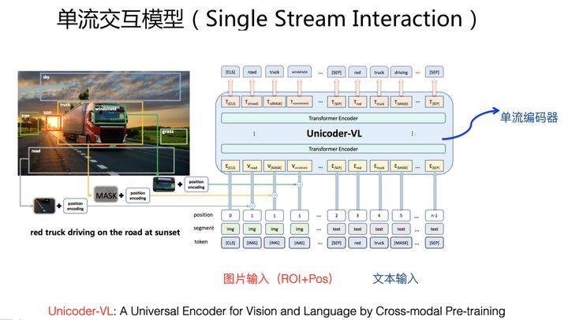

​		典型的单流交互模型结构如上图Unicoder-VL模型所示。单流和双流的区别在于：单流模型只用一个Transformer，而双流模型，如上所述，需要三个Transformer各自分工协作。输入的图片，经过上述的Faster-RCNN物体识别和位置编码后，和文本单词拼接，整体作为Transformer模型的输入。也就是说，单流模型靠单个Transformer，同时学习文本内部单词交互、图片中包含物体之间大的交互，以及文本-图片之间的细粒度语义单元之间的交互信息。单流模型的预训练目标，与双流交互模型是类似的，往往也需要联合学习文本预训练、图片预训练以及对齐预训练三个目标。典型的单流模型包括Unicoder-VL、VisualBERT、VL-VERT、UNITER等。

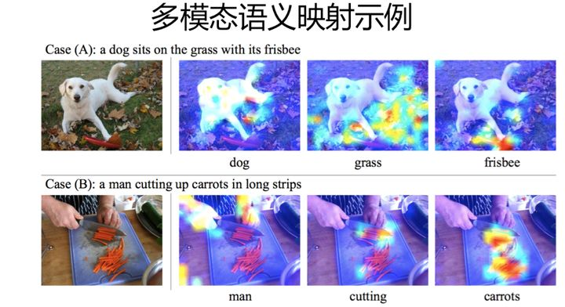

​		经过多模态预训练之后，是否模型能够建立起不同模态信息之间的语义映射关系呢？答案可以参考上图：经过预训练后，输入一句话以及对应的图片进入模型，对于文本中的某个单词，我们可以观察这个单词与图片中哪块区域联系密切（根据Attention强度信息可以看出）。从上图示例可以看出，预训练模型确实学会了不同模态单词语义之间的映射关系。

​		多模态模型经过预训练之后，针对具体的应用任务，可以采取第二阶段Fine-tuning的模式增强应用效果。从上述描述可见，单流模型结构相对简单，模型参数也相对少些，而且能够在模型底层及早对不同模态之间的语义直接建立联系，所以看起来比双流模式更有发展前景，但是从目前的各种研究对比实验结果看，貌似两种方法的效果在伯仲之间。不过，可以得出的结论是，采用预训练模型的多模态方法，比不用预训练的传统方法，在应用效果上是有明显提升的。

​		目前来看，如果希望多模态预训练有更快速的技术发展，以下几个方面是需要重点关注的：

​		首先，也是最重要的，可能是急需构建不同模态间的大规模对齐数据。目前，“图片-文本”类型的对齐数据规模尚可，但是继续扩大数据规模无疑是有益的；对其它类型的模态组合而言，大规模的标准对齐数据比较缺乏，这会严重制约多模态预训练的发展。所以明显需要数据先行，这是发展技术的前提条件；

​		其次，感觉在自由文本预训练研究领域中，目前得到的一些得到验证的经验，推理起来，应该是能够直接迁移到多模态预训练领域的。典型的经验，比如：在扩大数据规模的同时，增加模型复杂度。增加模型复杂度包括图片特征抽取器模型复杂度（已经有实验验证加深ResNet模型对效果提升明显），以及增加对应的Transformer层深，放大Transformer的Hidden Size等，相信这是能够大幅提升多模态预训练的首选手段；再比如文本预训练任务中的Mask对象，采用Span方式而非单词方式（已有工作这么做了），加大Batch Size延长训练时间等训练方法优化手段，想来都应该是有益的；从训练目标来说，目前的模态间对齐任务还是有点类似NSP这种句子分类任务，明显偏简单了一些，这块可以考虑引入更有难度的对齐任务，以及实体级别细粒度的对齐任务，来增强模态对齐模型的效果。

​		再次，可以考虑由目前的两模态向真正的多模态扩展，比如三模态动态联合训练，目前常见的是“文本-图片”，或者“文本-视频”，通常是两模态结构，后面可以考虑“文本-图片-音频”，或者“文本-视频-音频”等三模态甚至更多模态的联合预训练。当然，这么做的前提，仍然是得先有多模态的对齐数据。


## 从两阶段到四阶段

​		经典的预训练模型框架下，一般我们解决NLP问题有两个阶段：第一阶段是模型预训练阶段，预训练模型从文本等信息中学习语言知识；第二阶段是Fine-tuning阶段，根据手上的有监督数据，对模型参数进行微调，以获得更好的任务效果。

​		预训练阶段的最明显发展趋势是大数据+大模型，在数据质量有保障的前提下，数据量越大，模型容量越大，预训练阶段学到的语言知识效果越好。其实，关于预训练数据，目前还有很多研究，能够得出另外一个结论：从领域、题材、类型等不同角度看，如果预训练数据和手上任务数据越接近，则预训练模型带来的收益就越大。

​		很多时候，我们手头上的任务数据有很强的领域性，比如可能是计算机领域的，因为预训练数据一般具备通用性，即使大量预训练文本里包含部分计算机类的文本，整体占比也很小。于是，这种情况下，由于领域差异比较大，预训练模型带给手头任务的收益，就没期望中那么大。一种直观的，也是不少人在用的解决方案是：把领域性文本，也加入到预训练数据中，一同参与预训练过程，这样能够增加预训练文本和手上任务的相似性，就能提升任务效果。事实上，这样做也确实能解决这个问题。但是，有一个问题：预训练阶段往往会兼顾模型的通用性，尽可能兼顾各种下游任务，希望模型能在不同领域都有效。而且，从趋势看，数据规模和模型规模会越来越大，也就是训练成本会越来越高。所以，这种把领域数据添加到预训练数据一起训练的做法，一则影响模型通用性，二则实现成本高，看上去就不是特别好的方法。

​		目前看，要解决这个问题，比较好的方法是把两个阶段分离：第一阶段仍然采取大数据、大模型，走通用普适、各种任务都能受益的路子，不特意考虑领域特点，因为兼顾不过来；第二阶段，在第一阶段训练好的通用预训练模型基础上，利用领域数据，再做一次预训练，等于把通用的预训练模型往领域方向拉动一下。这样两个阶段各司其职，有独立的优化目标，也能兼顾通用性和领域适配性。

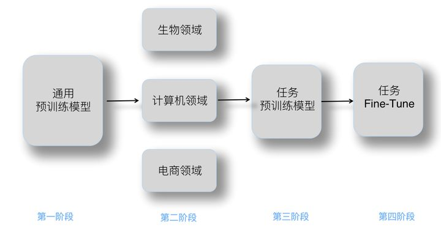

​		上面这个方法，我猜应该不少人都已经在这么做了，论文“Don’t Stop Pretraining: Adapt Language Models to Domains and Tasks”也通过大量实验验证了领域数据预训练（DAPT）的有效性，再结合它得出的另外一个重要结论：用手上的任务数据，无论大小，如果做一次任务级数据预训练（TAPT），也就是拿着手上任务数据，在通用预训练模型基础上，再做一次预训练，也能够有效提升任务效果。综合这个文章和其它有关文章的结论，我们不难看出，要想更好地提升任务效果，我们应该从传统的两阶段模型，拓展到如下四阶段模型（参考上图）：

​		第一个阶段：通用预训练

​		这就是传统两阶段模式中的第一阶段。这个阶段不仅仅追求效果好，也追求领域通用性。它的优化目标是：在尽可能多的下游任务场景中，效果都尽可能好，但不单独考虑某个特殊领域的效果如何。这个阶段，目前看总的发展趋势是：在数据质量有保证的前提下，增加数据数量，以及数据的多样性，同时提升模型复杂度，这样可以提供普遍有效的模型增强能力。很明显，这个阶段，一般只有土豪公司才能做得起，而且从趋势看，会越来越如此。将来的发展模式可能是，超级土豪公司不断优化这个模型，然后放出来供大家用，有能力做这个事情的人，应该会越来越少。

​		第二个阶段：领域预训练

​		在第一阶段训练好的通用预训练模型基础上，利用不同领域的自由文本，构建多个、不同领域的领域预训练模型。比如我们可以分别收集计算机领域、生物领域、电商领域…等等，多个不同领域的无标注自由文本数据。在第一阶段通用模型基础上，分别用各个领域数据，再分别做一次预训练，这样我们就得到了适合解决各个不同领域的预训练模型：计算机领域、生物领域、电商领域…..等等多个不同的预训练模型。下游任务可以根据自己任务的领域，选择适配性好的领域预训练模型来使用。

​		这个阶段的预训练模型，在训练的时候，有个独特的问题需要解决：灾难遗忘问题。所谓“灾难遗忘”，就是说，当你用领域数据进行预训练的时候，因为会调整第一阶段预训练模型的参数，这种偏向领域性的参数调整，可能会导致第一阶段模型学好的参数被改写，这意味着：经过第二阶段预训练，第一阶段预训练模型里学会的很多通用语言知识，可能会被冲掉。灾难遗忘就是这个意思。灾难遗忘问题，对于预训练模型，尤其是领域预训练模型来说，是个很关键也很重要的问题，目前也有一些解决方案，限于篇幅，这里就不展开了。

​		这个阶段的预训练，因为数据量相比第一阶段会小很多，所以其实中农公司甚至贫农公司也能做得起，不存在土豪门槛，大家应该都能做。当然，一般我们只做跟自己手头任务相关的领域的预训练模型。如果你想做很多领域的预训练模型，那估计也要备足银行卡。估计后续也会有土豪公司做好很多不同领域的预训练模型，供大家个性化适配使用，虽说目前还没有，但是推断起来，这是个大概率会发生的事件。

​		第三个阶段：任务预训练

​		在前两个预训练模型基础上，比如从第二个阶段里面的多个不同的领域预训练模型中，选择和手头任务适配的那个领域预训练模型，在这个模型基础上，用手头数据，抛掉数据标签，再做一次预训练，无论手上任务数据有多少。比如手上任务是计算机领域的，那么从第二阶段的多个领域模型里面，选择计算机领域适配过的预训练模型，在这个模型基础上进行一次任务级别的预训练。这样应该能明显提升任务效果。

​		第四阶段：任务Fine-tuning

​		这是传统两阶段的第二阶段，做法一样，没什么好讲的。

​		当然，如果你手上的任务没有那么强的领域性，可以跳过第二阶段，也就是那个领域预训练模型阶段，走剩余的三阶段模式即可，无论如何，任务预训练都是值得做的一个事情。


## 如何构造强大的预训练模型

​		对于语言理解类任务，假设你的任务不是领域性特别强那种类型的，建议采取如下技术方案：

​		使用三阶段模型：通用预训练+任务预训练+任务Fine-tuning。在做完第一阶段预训练后，用手头任务数据，抛掉标签，再做一次任务预训练，然后任务Fine-tuning。

​		模型结构建议采取Encoder+Decoder结构，或者Encoder-AE结构；预训练任务配置两个：独立生成Span类语言模型及SOP句子任务；在质量优先的前提下，增加预训练数据的数量；比较关键的一点是，一定要增加模型容量：可以纵向增加Transformer Block层深，或者横向调大Transformer相应位置可配置参数大小。当然，如果你不差钱，两个可以一起上。另外，要使得模型得到充分训练，就是说增大训练过程中的Batch Size和训练步长。

​		对于语言生成类任务，建议采取如下技术方案：

​		使用两阶段模型：通用预训练+任务Fine-tuning。模型结构建议采取Encoder+Decoder结构，或者Decoder-AR结构；预训练任务采用独立生成Span类语言模型；在质量优先的前提下，增加预训练数据的数量；同样，比较关键的一点是，一定要增加模型容量：可以纵向增加Transformer Block层深，或者横向调大Transformer相应位置可配置参数大小。当然，如果你不差钱，两个可以一起上。另外，也要使得模型得到充分训练，就是说增大训练过程中的Batch Size和训练步长。

​		相信采取上述技术方案，能在打榜过程中获得很好的名次，或者在实际工作中能比较快地完成自己的KPI或OKR。当然，如果是走落地应用的路子，关于知识蒸馏等一系列如何将模型做小这方面，记得要多花点功夫。
