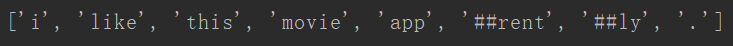
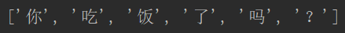
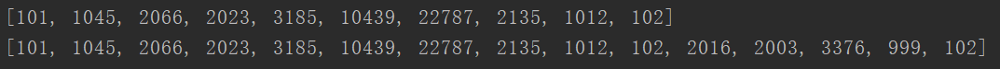
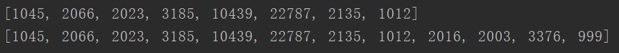
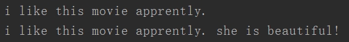
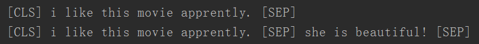
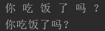

[TOC]

# BertTokenizer


## 参数

- `vocab_file` 词表文件路径
- `do_lower_case` 是否把字母变成小写
- `do_basic_tokenize`是否做在分词前做预处理（按标点、空格等分割句子，并处理是否统一小写，以及清理非法字符）

- `never_split` 指定一个列表，对列表内的词不进行分割
- `tokenize_chinese_chars` 是否对中文进行分割（对于中文字符，通过加空格来按字分割）

- `strip_accents` 是否清楚掉所有的音调

- `unk_token`
- `cls_token`
- `sep_token`
- `pad_token`
- `mask_token`


## 属性

- `vocab` BERT 词表对象，其中包含两个属性（w2i：词语到id的映射字典，i2w：id到词语的映射字典）
- `model_input_names` BERT 模型输入需要的变量（"input_ids", "token_type_ids", "attention_mask"）
- `basic_tokenizer`  负责分词前的预处理，按标点、空格等分割句子，并处理是否统一小写，以及清理非法字符。对于中文字符，通过预处理（加空格）来按字分割；同时可以通过never_split指定对某些词不进行分割；这一步是可选的（默认执行）。

- `wordpiece_tokenizer` 在词的基础上，进一步将词分解为子词（subword）。subword 介于 char 和 word 之间，既在一定程度保留了词的含义，又能够照顾到英文中单复数、时态导致的词表爆炸和未登录词的 OOV（Out-Of-Vocabulary）问题，将词根与时态词缀等分割出来，从而减小词表，也降低了训练难度；例如，tokenizer 这个词就可以拆解为“token”和“##izer”两部分，注意后面一个词的“##”表示接在前一个词后面。

   

## 方法

**BertTokenizer 实现了基类中的 tokenize 接口，以及重写了 _subword_merge，build_inputs_with_special_tokens，create_token_type_ids_from_sequences 方法**


### tokenize

 <span id="tokenize">`tokenize(self, text: str) -> List[str]`</span>

**实现了基类 BaseTokenizer 中的接口**

输入生语料的字符串，输出分词结果，分词结果是一个列表


### _subword_merge

<span id="_subword_merge">`_subword_merge(self, tokens: List[str]) -> List[str]`</span>

将 token 列表中的子词（在 BertTokenizer 中就是以“##...”开头的词语 ）合成一个词语


### build_inputs_with_special_tokens 

<span id="build_inputs_with_special_tokens">`def build_inputs_with_special_tokens(self, token_ids_0: List[int], token_ids_1: Optional[List[int]] = None) -> List[int]:`</span>

将输入字符串（或者字符串对）转为 id 序列之后，还需要添加一些特殊字符，才能作为 BERT 模型的输入，BERT 模型的输入序列格式如下：

- 单句：`[CLS] S [SEP]`
- 句对：`[CLS] S0 [SEP] S1 [SEP]`


### create_token_type_ids_from_sequences

<span id="create_token_type_ids_from_sequences">`create_token_type_ids_from_sequences(self, token_ids_0: List[int], token_ids_1: Optional[List[int]] = None) -> List[int]`</span>

通过输入的字符串（对）序列的 token id 序列获取它的 “token_type_id”，BERT 模型的  “token_type_id” 格式如下：

```
0 0 0 0 0 0 0 0 0 0 0 1 1 1 1 1 1 1 1 1
| 序列0              | 序列1            |
```

如果序列1不存在（输入是一个单独的句子），那么 “token_type_id” 就是一个全为0的列表


## 示例

**导入 BertTokenizer，通过词表文件构造 BertTokenizer 对象**

```\
from tokenizations.tokenization_bert import BertTokenizer

# 构造 tokenizer
# 词表为 bert-base-uncased
tokenizer_en = BertTokenizer("../data/vocab_data/bert/bert-base-uncased_vocab.txt")
# 构造 tokenizer
# 词表为 google_zh_vocab
tokenizer_zh = BertTokenizer("../data/vocab_data/bert/google_zh_vocab.txt")
```


**对一个句子进行分词**

`tokenizer.tokenize`

英文

```
sentence = 'I like this movie apprently.'
# 单句分词
print(tokenizer_en.tokenize(sentence))
```



中文

```
sentence = '你吃饭了吗？'
# 单句分词
print(tokenizer_zh.tokenize(sentence))
```




**将句子/句对转化为输入 BERT 的形式（id 序列，加上 [CLS]、[SEP]）**

`tokenizer.encode`

```
sentence = ['I like this movie apprently.', 'She is beautiful!']
# 单句编码
print(tokenizer_en.encode(sentence[0]))
# 句对编码
print(tokenizer_en.encode(sentence[0], sentence[1]))
```



如果不想加特殊字符（[CLS]、[SEP]），可以把参数 `add_special_tokens` 设为 False （默认为 True)

```
# 单句编码
print(tokenizer_en.encode(sentence[0], add_special_tokens=False))
# 句对编码
print(tokenizer_en.encode(sentence[0], sentence[1], add_special_tokens=False))
```




**将 id 序列转回句子**

`tokenizer.deocde`

将上一步得到的 id 序列作为输入

```
list0 = [101, 1045, 2066, 2023, 3185, 10439, 22787, 2135, 1012, 102]
list1 = [101, 1045, 2066, 2023, 3185, 10439, 22787, 2135, 1012, 102, 2016, 2003, 3376, 999, 102]
```

```
print(tokenizer_en.decode(list0))
print(tokenizer_en.decode(list1))
```



如果想要保留 [CLS]、[SEP]，可以把参数 `skip_special_tokens` 设为 False （默认为 True）

```
print(tokenizer_en.decode(list0, skip_special_tokens=False))
print(tokenizer_en.decode(list1, skip_special_tokens=False))
```



**注意，这里把原句中的 I 还原为了小写的 i，是因为使用的是 uncased（大小写无关）的词表，所有词都被转为了小写**

如果处理的是中文，则需要把参数 `spaces_between_tokens` 设为 False（默认为 True），因为中文的字之间是不需要用空格分割的

```
sentence = '你吃饭了吗？'
list0 = tokenizer_zh.encode(sentence)
print(tokenizer_zh.decode(list0))
print(tokenizer_zh.decode(list0, spaces_between_tokens=False))
```




**构造 BERT 模型需要的所有输入信息**

`tokenizer.encode_plus`

BERT 模型需要的所有输入信息包括 "input_ids", "token_type_ids", "attention_mask"

```
sentence = 'I like this movie apprently.'
print(tokenizer_en.encode_plus(sentence))
```

太长了不好截图，结果如下：

```
{'input_ids': [2, 31, 101, 48, 1308, 4865, 8993, 102, 9, 3, 39, 25, 1632, 187, 3], 'token_type_ids': [0, 0, 0, 0, 0, 0, 0, 0, 0, 0, 1, 1, 1, 1, 1], 
'attention_mask': [1, 1, 1, 1, 1, 1, 1, 1, 1, 1, 1, 1, 1, 1, 1]}
```


