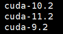

[TOC]

## 安装

### 下载项目

项目地址：https://github.com/THUDM/SwissArmyTransformer

```
git clone https://github.com/THUDM/SwissArmyTransformer.git
```


### 下载预训练模型

```
https://dorc.baai.ac.cn/resources/MDHub/glm-10b-en.tar.gz
 
https://dorc.baai.ac.cn/resources/MDHub/glm-10b-zh.tar.gz
 
https://dorc.baai.ac.cn/resources/MDHub/glm-large-en-blank.tar.gz
 
https://dorc.baai.ac.cn/resources/MDHub/glm-large-zh.tar.gz
```

修改`example/glm/scripts/finetune_sst2.sh`中的 CHECKPOINT_PATH 到模型包所在文件夹的路径


根据使用的模型，在脚本文件中修改 source 引用的脚本文件


`glm/config`路径下的四个脚本文件分别对应四个模型

```
model_glm_10B.sh            # glm-10b-en
model_glm_10B_chinese.sh    # glm-10b-zh
model_glm_large_chinese.sh  # glm-large-zh
model_lm_roberta_large.sh   # glm-large-en-blank
```


### 准备数据

下载 SST2 情感分类数据集

在脚本中修改路径到数据存放的路径


### 准备 hostfile 文件

在 `examples/glm` 下建一个文件，命名为 `hostfile_single`

在里边写入

```
hostname slots=n
```

在终端输入 `hostname` 命令可以得到主机名，`slots` 代表这台机器有几张卡

**如果因为监听端口问题报 Bug: connection 22 refused 这个错，那可以在运行 deepspeed 的时候不要加 hostfile 文件，默认在本地（具体见可能遇到的问题）**


### 配置环境

创建虚拟环境（anaconda3）

```
conda create -n SAT python=3.7
```

安装需要的包

```
pip install -r requirements.txt
```

**注意，pytorch 最好安装 1.10.* 的，我一开始装的 1.8.* 遇到了一些奇怪的问题**

**注意自己的 CUDA 版本要和 pytorch 版本适配，不然安装 apex 的时候可能会出错**

安装apex

```
git clone https://github.com/NVIDIA/apex
cd apex
pip install -v --no-cache-dir --global-option="--cpp_ext" --global-option="--cuda_ext" ./
```


### 运行

在 `finetune_glm_sst2.py` 加入一行代码

```python
sys.path.append("../..")
```

到 `examples/glm` 里运行

```
bash scripts/finetune_sst2.sh
```

**运行过程中如果遇到缺少...包的情况再针对性地 pip install 即可**


## 可能遇到的问题

### ModuleNotFoundError: No module named ‘fused_layer_norm_cuda‘

这是 apex 的安装出了问题

先看看自己的 CUDA 版本和 pytorch 的适配的 CUDA 版本一不一致

```
nvcc -V # 查看 CUDA 版本
```

```
import torch

print(torch.version.cuda) # 查看 pytorch 适配的 CUDA 版本
```

**如果不一致，apex 安装的时候可能不会报错，但是在使用时会出现问题**

**我的环境：CUDA 10.2，pytroch 1.10.1（CUDA 10.2）**

装一下相应版本的 CUDA [不同版本 CUDA 下载](https://developer.nvidia.com/cuda-toolkit-archive)


根据自己的机器选择对应的选项，根据 instructions 进行安装


安装完成之后，查看路径 `usr/loacl` 下，可能会有多个版本的 cuda



在 `~/.bashrc` 或者 `~/.zshrc`（如果用的是 zsh）中配置环境变量

```
export PATH=$PATH:/usr/local/cuda/bin
export CUDA_HOME=/usr/local/cuda
export LD_LIBRARY_PATH=$LD_LIBRARY_PATH:/usr/local/cuda/lib64
```

*注意，安装10.2版本的时候有个选项，可以建立一个软连接，效果如下：


所以配置环境变量的时候路径就直接用的 `cuda` ，如果没有设置软连接用 `cuda-10.2` 也可以


### apex 安装的时候编译错误

先检查一下 CUDA 版本和 pytorch 的适配的 CUDA 版本一不一致（这部分见上一个问题）

如果没问题，那么可能是 g++ 版本的问题

检查一下 g++ 版本

```
g++ -v
```

查看当前安装的版本

```
ll /usr/bin/gcc*
```

**我本来的版本是 gcc-5，安装 apex 的时候编译会出错，改成 gcc-7 以后就没问题了**

安装 gcc-7

```shell
sudo apt install g++ # 不用指定版本，默认的安装的版本就是7.x
```

装完之后再检查一下版本


这时候再重新安装 apex


### invalid syntax


红线部分语法报错的，pytorch 版本的问题，我最开始用的是 1.8.0 遇到过这个问题，改装 1.10.1 就可以了


### Bug: connection 22 refused

端口问题，ssh 设置的监听端口不是 22，连接不上

如果是单机的情况下，最简单的方式是在 `deepspeed` 命令中不要添加 `--hostfile` 参数，默认会在本机上运行

